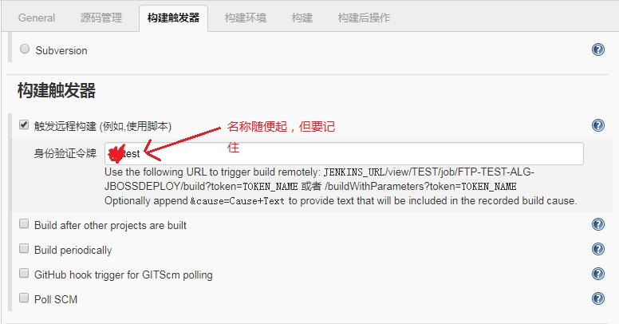
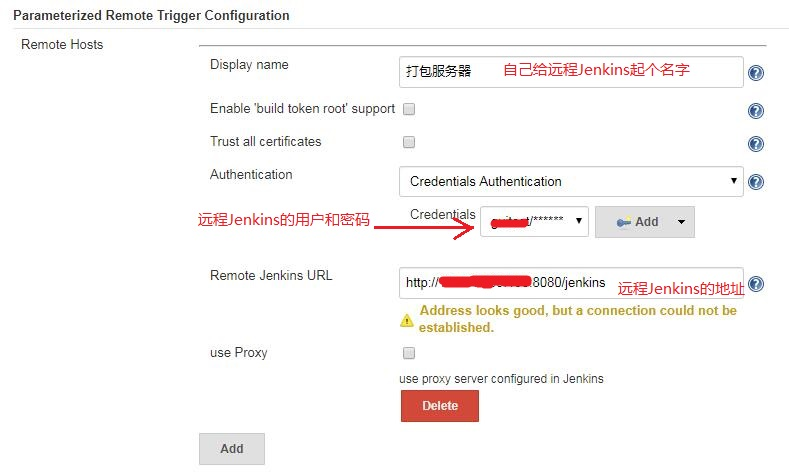
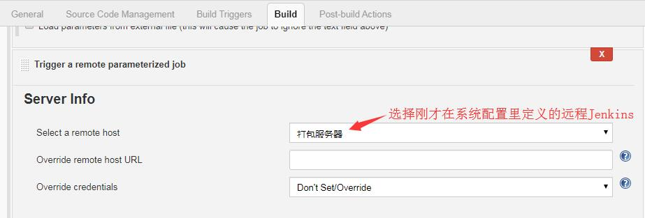
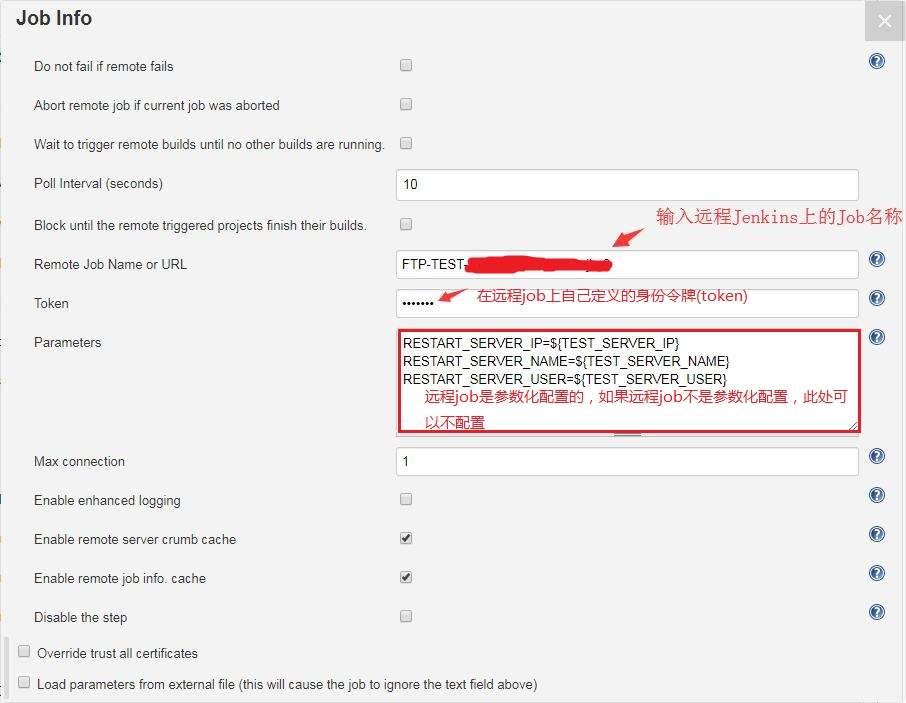

  最近在工作中遇到了Jenkins本地job去调用远程Jenkins上job的需求，经过研究，完成了需求，并将过程记录。  

## 远程job  
在远程Jenkins里需要被调用的job里把构建触发器里面的**触发远程构建**勾上，并输入身份验证令牌(token)  
  

## 本地job  
首先本地Jenkins安装插件:`Parameterized Remote Trigger Plugin`  
其次在本地Jenkins的系统管理的系统配置里添加远程Jenkins的信息  
  
接着在本地Job里添加需要调用远程Job的信息  
  
  

这样就完成了本地Jenkins的job调用远程Jenkins的job，在调用远程job的前后，本地job也可以执行本地自定义的动作。