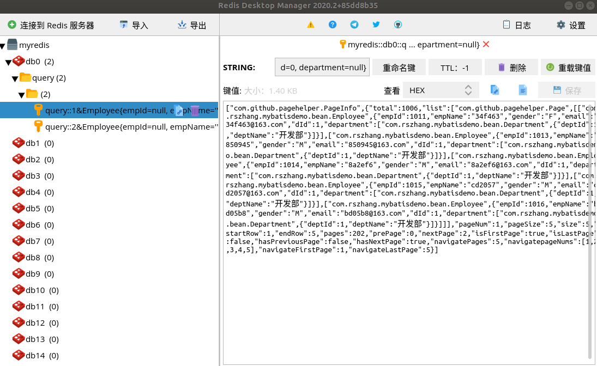

# SpringBoot与缓存  

## 缓存注解  

### @EnableCaching  

开启基于注解的缓存，此注解需要加在SpringBoot的启动类上  。

例如：  

``` java
import org.mybatis.spring.annotation.MapperScan;
import org.springframework.boot.SpringApplication;
import org.springframework.boot.autoconfigure.SpringBootApplication;
import org.springframework.cache.annotation.EnableCaching;

@SpringBootApplication
@EnableCaching
@MapperScan("com.rszhang.mybatisdemo.dao")
public class MybatisdemoApplication {

    public static void main(String[] args) {
        SpringApplication.run(MybatisdemoApplication.class, args);
    }

}
```


### @Cacheable  

根据方法的请求参数对其结果进行缓存，以后再请求相同的数据，直接从缓存中获取，不用调用方法。

#### @Cacheable的属性

@Cachable有以下几个属性：

* cacheNames/value： 缓存的名字，在spring配置文件中定义，必须指定至少一个，是数组的方式。
* key：缓存数据使用的key。可以为空，如果为空，则按照方法的所有参数值进行组合；如果不为空，则要按照SpEL表达式进行编写。
* keyGenerator：缓存数据时key生成策略。可以自己指定key的生成策略。key和keyGenerator只能二选一。
* cacheManager：缓存管理器。与cacheResolver二选一。
* condition：指定符合条件的情况下才缓存。使用SpEL表达式编写，可以为空。在调用方法之前之后都能判断
* unless：否决缓存。当unless指定的条件为true的时候，方法的返回值就不会被缓存。只在方法执行之后判断。
* sync：是否使用异步模式。为true的情况下，不支持unless。


#### SpEL可用的元数据 

| 名字          | 位置               | 描述                                                         | 示例                 |
| ------------- | ------------------ | ------------------------------------------------------------ | -------------------- |
| methodName    | root object        | 当前被调用的方法名                                           | #root.methodName     |
| method        | root object        | 当前被调用的方法                                             | #root.method.name    |
| target        | root object        | 当前被调用的目标对象                                         | #root.target         |
| targetClass   | root object        | 当前被调用的目标对象类                                       | #root.targetClass    |
| args          | root object        | 当前被调用的方法的参数列表                                   | #root.args[0]        |
| caches        | root object        | 当前方法调用使用的缓存列表(如@ Cacheable(value={"cache1","cache2"}) ), 则有两个 cache | #root.caches[0].name |
| argument name | evaluation context | 方法参数的名字 . 可以直接 #参数名 ,也可以使用 #p0或#a0 的形式,0代表参数的索引; | #iban 、 #a0 、 #p0  |
| result        | evaluation context | 方法执行后的返回值(仅当方法执行之后的判断有效,如‘ unless’ , ’cache put’ 的表达式 ’cache evict’ 的表达式beforeInvocation=false ) | #result              |

> #root在使用时可以省略不写。#root.args[0]可以写成args[0]

#### @Cacheable的运行流程  

1. 方法运行之前，先去查询Cache，按照cacheNames/value指定的名字去获取，第一次获取缓存如果没有Cache组件会自动创建。

2. 去Cache中查找缓存的内容，查找的方式是通过key去查找。key是按照某种策略生成的，默认使用keyGenerator接口生成，默认的实现类是SimpleKeyGenerator。

   SimpleKeyGenerator类生成key的策略为：

   * 如果没有参数，key=new SimpleKey();
   * 如果有一个参数，key=参数的值
   * 如果有多个参数，key=new SimpleKey(params)

3. 没有查到缓存就调用目标方法。

4. 将目标方法返回的结果，放进缓存中。


#### 定制keyGenerator  

编写配置类

``` java
package com.rszhang.mybatisdemo.config;

import org.springframework.cache.interceptor.KeyGenerator;
import org.springframework.context.annotation.Bean;
import org.springframework.context.annotation.Configuration;

import java.lang.reflect.Method;
import java.util.Arrays;

@Configuration
public class MyCacheConfig {

    @Bean("myKeyGenerator")
    public KeyGenerator keyGenerator() {
        return new KeyGenerator() {

            @Override
            public Object generate(Object o, Method method, Object... objects) {
                return method.getName()+"[" + Arrays.asList(objects).toString() + "]";
            }
        };
    }

}
```

使用时指定定制的策略  

```java
@Cacheable(value = "query", key = "myKeyGenerator")
```


### @CachePut  

即调用方法，又更新缓存。

运行流程：

1.  先调用目标方法
2. 将目标方法的结果缓存起来


### @CacheEvict  

清除缓存。

属性：

* allEntries：是否清空所有缓存内容,缺省为 false,如果指定为true,则方法调用后将立即清空所有缓存
* beforeInvocation：是否在方法执行前就清空,缺省为 false,如果指定为 true,则在方法还没有执行的时候就清空缓存,缺省情况下,如果方法执行抛出异常,则不会清空缓存


## 整合redis  

redis的资料可以查阅Redis中文网[http://redis.cn](http://redis.cn)  


### SpringBoot引入redis  

#### 在pom文件中加入redis的starter  

```xml
<dependency>
    <groupId>org.springframework.boot</groupId>
    <artifactId>spring-boot-starter-data-redis</artifactId>
</dependency>
```


#### 添加redis配置  

在SpringBoot的配置文件中加入redis的配置，在application.yml添加如下内容  

```yaml
  cache:
    type: redis
    
  redis:
    host: 127.0.0.1
    port: 6379
    jedis:
      pool:
        max-active: 20  # 最大连接数（使用负值表示没有限制）
        max-wait: 1000  # 连接池最大阻塞等待时间（使用负值表示没有限制）
        max-idle: 8  # 连接池中的最大空闲连接
        min-idle: 1  # 连接池中的最小空闲连接
    timeout: 2000  # 连接超时时间（毫秒）
    database: 0
```


#### 启动类上开启缓存注解  

在启动类上加上注解@EnableCaching  

``` java
package com.rszhang.mybatisdemo;

import org.mybatis.spring.annotation.MapperScan;
import org.springframework.boot.SpringApplication;
import org.springframework.boot.autoconfigure.SpringBootApplication;
import org.springframework.cache.annotation.EnableCaching;

@SpringBootApplication
@EnableCaching
@MapperScan("com.rszhang.mybatisdemo.dao")
public class MybatisdemoApplication {

    public static void main(String[] args) {
        SpringApplication.run(MybatisdemoApplication.class, args);
    }
}
```


#### 在SpringBoot中测试使用redis  

```java
package com.rszhang.mybatisdemo.cache;

import com.rszhang.mybatisdemo.bean.Employee;
import com.rszhang.mybatisdemo.dao.EmployeeMapper;
import org.junit.Test;
import org.junit.runner.RunWith;
import org.springframework.beans.factory.annotation.Autowired;
import org.springframework.boot.test.context.SpringBootTest;
import org.springframework.data.redis.core.RedisTemplate;
import org.springframework.data.redis.core.StringRedisTemplate;
import org.springframework.test.context.junit4.SpringRunner;

@RunWith(SpringRunner.class)
@SpringBootTest
public class SpringBootRedisTest {

    @Autowired
    EmployeeMapper employeeMapper;

    @Autowired
    StringRedisTemplate stringRedisTemplate;

    @Autowired
    RedisTemplate redisTemplate;

    @Autowired
    RedisTemplate<Object, Employee> employeeRedisTemplate;

    @Test
    public void test01() {
        // 操作字符串
        stringRedisTemplate.opsForValue().append("msg", "hello");  // 写字符串

        String msg = stringRedisTemplate.opsForValue().get("msg");  // 读字符串
        System.out.println(msg);

        // 操作字符串
        stringRedisTemplate.opsForList().leftPush("mylist", "1");
        stringRedisTemplate.opsForList().leftPush("mylist", "2");
    }

    @Test
    public void test02() {
        // Employee 必须要序列化
        Employee employee = employeeMapper.selectByPrimaryKey(1012);
        redisTemplate.opsForValue().set("emp-01", employee);

        // 使用json序列化
        employeeRedisTemplate.opsForValue().set("emp-02", employee);
    }
}
```

MyRedisConfig.java  

```java
package com.rszhang.mybatisdemo.config;

import com.rszhang.mybatisdemo.bean.Employee;
import org.springframework.context.annotation.Bean;
import org.springframework.context.annotation.Configuration;
import org.springframework.data.redis.connection.RedisConnectionFactory;
import org.springframework.data.redis.core.RedisTemplate;
import org.springframework.data.redis.serializer.Jackson2JsonRedisSerializer;

import java.net.UnknownHostException;

@Configuration
public class MyRedisConfig {

    /**
     * 使用json将Employee序列化
     * @param redisConnectionFactory
     * @return
     * @throws UnknownHostException
     */
    @Bean
    public RedisTemplate<Object, Employee> empRedisTemplate(RedisConnectionFactory redisConnectionFactory) throws UnknownHostException {
        RedisTemplate<Object, Employee> template = new RedisTemplate();
        template.setConnectionFactory(redisConnectionFactory);
        // 使用 Jackson2JsonRedisSerializer
        Jackson2JsonRedisSerializer<Employee> serializer = new Jackson2JsonRedisSerializer<Employee>(Employee.class);
        template.setDefaultSerializer(serializer);
        return template;
    }
}
```


#### 自定义redis的config类  

如果想要序列化成json格式的数据，可以自定义一个redis的config类，设置序列化规则即可

RedisConfig.java  

```java
package com.rszhang.mybatisdemo.config;

import com.fasterxml.jackson.annotation.JsonAutoDetect;
import com.fasterxml.jackson.annotation.PropertyAccessor;
import com.fasterxml.jackson.databind.ObjectMapper;
import org.springframework.beans.factory.annotation.Autowired;
import org.springframework.cache.annotation.CachingConfigurerSupport;
import org.springframework.context.annotation.Bean;
import org.springframework.context.annotation.Configuration;
import org.springframework.data.redis.cache.RedisCacheConfiguration;
import org.springframework.data.redis.cache.RedisCacheManager;
import org.springframework.data.redis.cache.RedisCacheWriter;
import org.springframework.data.redis.connection.RedisConnectionFactory;
import org.springframework.data.redis.core.RedisTemplate;
import org.springframework.data.redis.serializer.Jackson2JsonRedisSerializer;
import org.springframework.data.redis.serializer.RedisSerializationContext;
import org.springframework.data.redis.serializer.StringRedisSerializer;

@Configuration
public class RedisConfig extends CachingConfigurerSupport {

    @Autowired
    private RedisConnectionFactory redisConnectionFactory;


    @Bean
    public RedisTemplate<String, Object> redisTemplate(RedisConnectionFactory redisConnectionFactory) {
        Jackson2JsonRedisSerializer<Object> serializer = new Jackson2JsonRedisSerializer<Object>(Object.class);
        ObjectMapper objectMapper = new ObjectMapper();
        objectMapper.setVisibility(PropertyAccessor.ALL, JsonAutoDetect.Visibility.ANY);
        objectMapper.enableDefaultTyping(ObjectMapper.DefaultTyping.NON_FINAL);
        serializer.setObjectMapper(objectMapper);

        RedisTemplate<String, Object> redisTemplate = new RedisTemplate<>();
        redisTemplate.setConnectionFactory(redisConnectionFactory);
        redisTemplate.setKeySerializer(new StringRedisSerializer());
        redisTemplate.setValueSerializer(serializer);
        redisTemplate.setHashKeySerializer(new StringRedisSerializer());
        redisTemplate.setHashValueSerializer(serializer);
        redisTemplate.afterPropertiesSet();

        return redisTemplate;
    }

    @Bean
    public RedisCacheManager redisCacheManager(RedisTemplate redisTemplate) {
        RedisCacheWriter redisCacheWriter = RedisCacheWriter.nonLockingRedisCacheWriter(redisTemplate.getConnectionFactory());
        RedisCacheConfiguration redisCacheConfiguration = RedisCacheConfiguration.defaultCacheConfig()
                .serializeValuesWith(RedisSerializationContext.SerializationPair.fromSerializer(redisTemplate.getValueSerializer()));
        return new RedisCacheManager(redisCacheWriter, redisCacheConfiguration);
    }
}
```

```java
/**
     * 根据条件查询员工
     * @return
     */
    @Cacheable(value = "query", key = "#pn + '&' + args[1]")
    public PageInfo getAll(Integer pn, Employee employee) {
        EmployeeExample example = new EmployeeExample();
        EmployeeExample.Criteria criteria = example.createCriteria();
        if (employee.getEmpName() != null && !employee.getEmpName().equals("")) {
            criteria.andEmpNameEqualTo(employee.getEmpName());
        }
        if (employee.getGender().equals("男")) {
            employee.setGender("M");
            criteria.andGenderEqualTo(employee.getGender());
        } else if (employee.getGender().equals("女")) {
            employee.setGender("F");
            criteria.andGenderEqualTo(employee.getGender());
        }
        if (employee.getEmail() != null && !employee.getEmail().equals("")) {
            criteria.andEmailEqualTo(employee.getEmail());
        }
        if (employee.getdId() != null && employee.getdId() != 0) {
            criteria.andDIdEqualTo(employee.getdId());
        }

        PageHelper.startPage(pn, 5);
        List<Employee> employees = employeeMapper.selectByExampleWithDept(example);

        PageInfo page = new PageInfo(employees, 5);

        return page;
    }
```


在Redis Desktop Manager中查看

