# SpringBoot使用MyBatis进行CRUD  

## 搭建框架  

### 使用SpringInitializr建立SpringBoot应用  

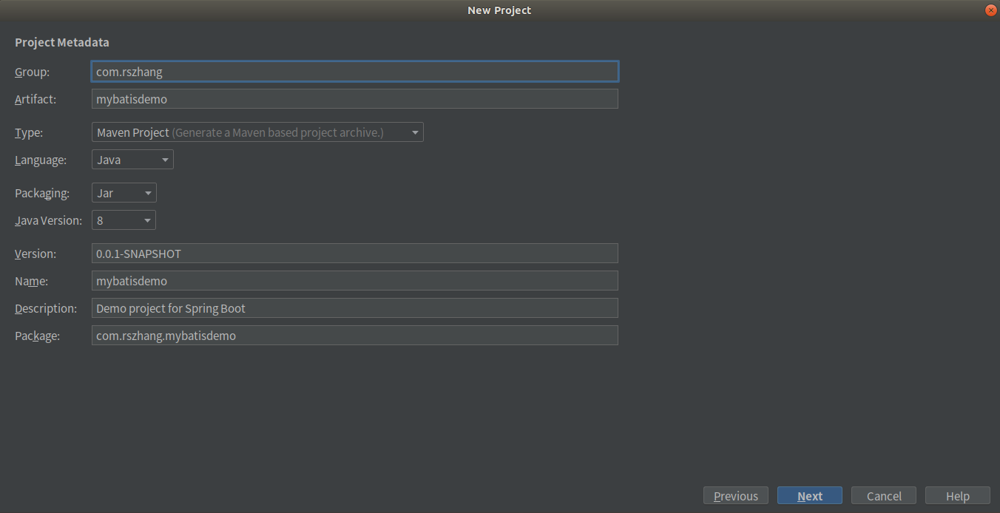  

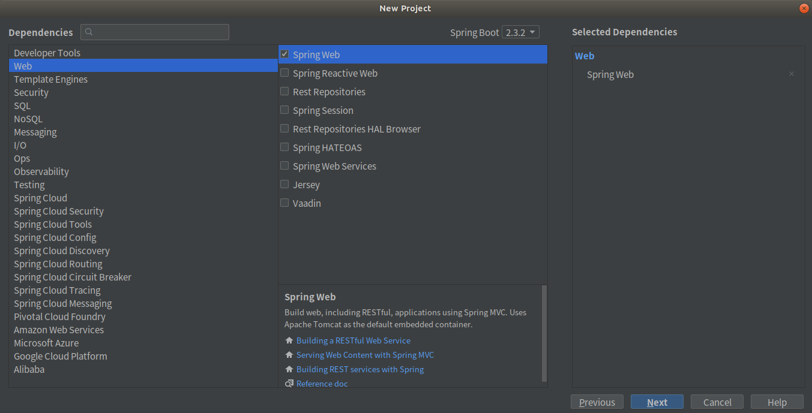  

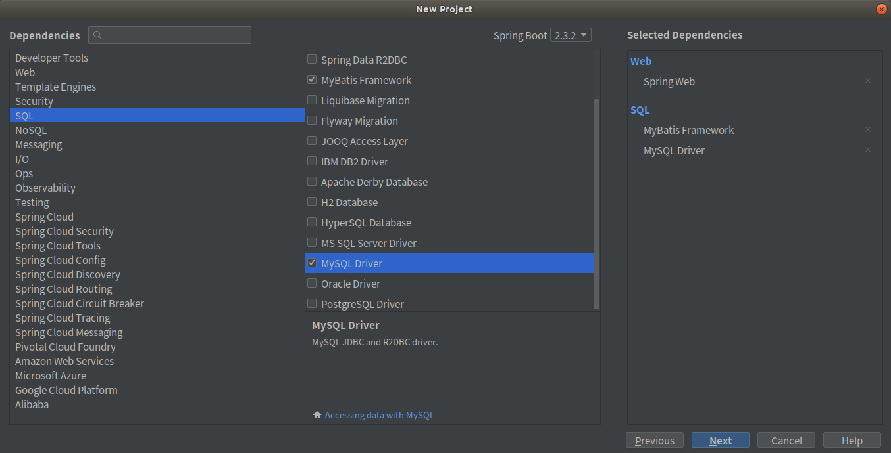  


### 引入Bootstrap  

打开[Bootstrap中文网](https://www.bootcss.com/)

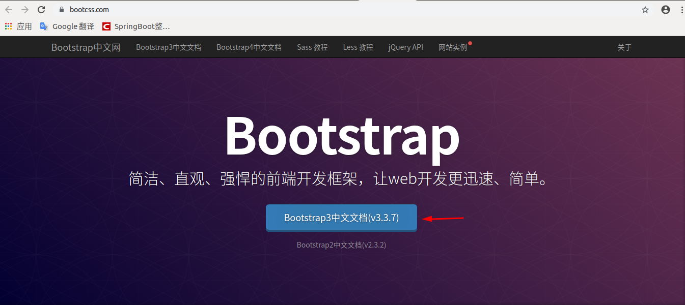  

点击BootStrap3中文文档

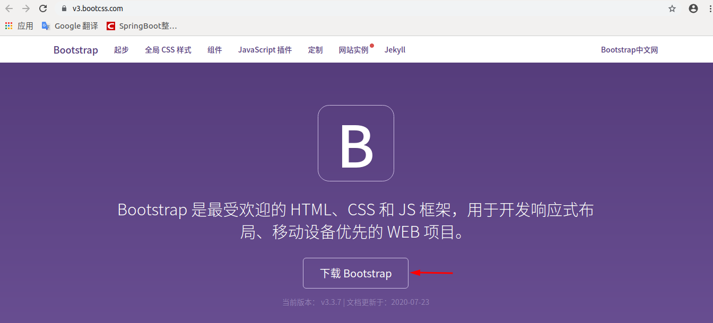  

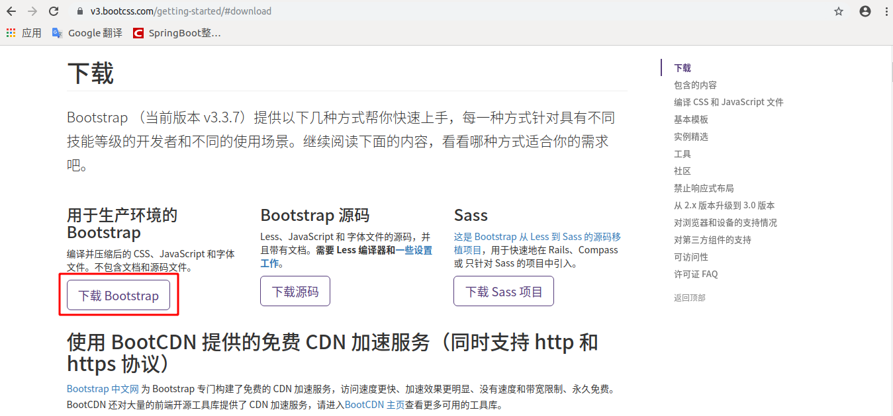  

点击下载Bootstrap，下载完成后，解压压缩包，然后将解压后的文件拷贝到src/main/resources/static目录下，如下图：

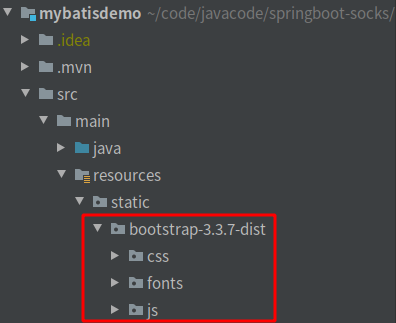  


### 引入jQuery  

下载jQuery，然后在src/main/resources/static目录下创建js的目录，然后拷贝jQuery放在此目录下，如下图：  

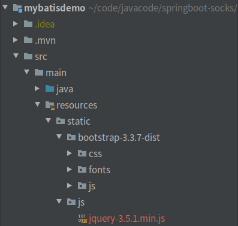  


### 准备数据库  

创建tbl_dept表 

```sql
CREATE TABLE `tbl_dept` (
  `dept_id` INT NOT NULL AUTO_INCREMENT,
  `dept_name` VARCHAR(255) NOT NULL,
  PRIMARY KEY (`dept_id`));
```

创建tbl_emp表  

```sql
CREATE TABLE `tbl_emp` (
  `emp_id` INT(11) NOT NULL AUTO_INCREMENT,
  `emp_name` VARCHAR(255) NOT NULL,
  `gender` CHAR(1) NULL,
  `email` VARCHAR(255) NULL,
  `d_id` INT(11) NULL,
  PRIMARY KEY (`emp_id`),
  INDEX `fk_emp_dept_idx` (`d_id` ASC),
  CONSTRAINT `fk_emp_dept`
    FOREIGN KEY (`d_id`)
    REFERENCES `tbl_dept` (`dept_id`)
    ON DELETE NO ACTION
    ON UPDATE NO ACTION);
```

### 使用MyBatis逆向工程  

①创建工程目录如下：  

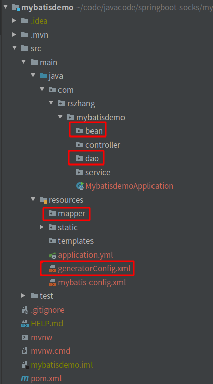  

②generatorConfig.xml内容如下：  

```xml
<?xml version="1.0" encoding="UTF-8"?>
<!DOCTYPE generatorConfiguration
        PUBLIC "-//mybatis.org//DTD MyBatis Generator Configuration 1.0//EN"
        "http://mybatis.org/dtd/mybatis-generator-config_1_0.dtd">
<generatorConfiguration>

    <context id="DB2Tables" targetRuntime="MyBatis3">
        <!--取消生成注释-->
        <commentGenerator>
            <property name="suppressAllComments" value="true" />
        </commentGenerator>

        <!-- 配置数据库连接 -->
        <jdbcConnection driverClass="com.mysql.cj.jdbc.Driver"
                        connectionURL="jdbc:mysql://127.0.0.1:3307/mybatis" userId="root"
                        password="123456">
        </jdbcConnection>

        <javaTypeResolver>
            <property name="forceBigDecimals" value="false" />
        </javaTypeResolver>

        <!-- 指定javaBean生成的位置 -->
        <javaModelGenerator targetPackage="com.rszhang.mybatisdemo.bean"
                            targetProject="./src/main/java">
            <property name="enableSubPackages" value="true" />
            <property name="trimStrings" value="true" />
        </javaModelGenerator>

        <!--指定sql映射文件生成的位置 -->
        <sqlMapGenerator targetPackage="mapper" targetProject="./src/main/resources">
            <property name="enableSubPackages" value="true" />
        </sqlMapGenerator>

        <!-- 指定dao接口生成的位置，mapper接口 -->
        <javaClientGenerator type="XMLMAPPER"
                             targetPackage="com.rszhang.mybatisdemo.dao" targetProject="./src/main/java">
            <property name="enableSubPackages" value="true" />
        </javaClientGenerator>


        <!-- table指定每个表的生成策略 -->
        <table tableName="tbl_emp" domainObjectName="Employee"></table>
        <table tableName="tbl_dept" domainObjectName="Department"></table>
    </context>
</generatorConfiguration>
```

> 注：generatorConfig.xml的头文件http://mybatis.org/dtd/mybatis-generator-config_1_0.dtd在IDEA中标红。解决方案：左边有红色小灯泡，点击Fetch external resource即可解决

mybatis-config.xml内容如下：  

```xml
<?xml version="1.0" encoding="UTF-8" ?>
<!DOCTYPE configuration
        PUBLIC "-//mybatis.org//DTD Config 3.0//EN"
        "http://mybatis.org/dtd/mybatis-3-config.dtd">
<configuration>

    <settings>
        <!--开启驼峰命名映射-->
        <setting name="mapUnderscoreToCamelCase" value="true"/>
        <!--开启懒加载-->
        <setting name="lazyLoadingEnabled" value="true"/>
        <!--配置按需加载-->
        <setting name="aggressiveLazyLoading" value="false"/>
    </settings>

</configuration>
```


③pom.xml中加入mybatis-generator插件  

```xml
<plugin>
    <groupId>org.mybatis.generator</groupId>
    <artifactId>mybatis-generator-maven-plugin</artifactId>
    <version>1.4.0</version>
    <configuration>
        <configurationFile>${basedir}/src/main/resources/generatorConfig.xml</configurationFile>
        <overwrite>true</overwrite>
        <verbose>true</verbose>
    </configuration>
    <!--指明插件所使用的JDBC驱动-->
    <dependencies>
        <dependency>
            <groupId>mysql</groupId>
            <artifactId>mysql-connector-java</artifactId>
            <version>8.0.21</version>
            <scope>runtime</scope>
        </dependency>
    </dependencies>
</plugin>
```

> 指明mybatis-generator插件所使用的JDBC驱动的依赖视情况可以省略，如果报generate failed: Exception getting JDBC Driver的错误时，需要指明驱动来尝试是否解决问题。如果没有报错，此依赖可以省略。


④选择Edit Configuration… 点击加号"+"添加，选择maven，填写名称(这里用mybatis generator)，命令行：mybatis-generator:generate -e  

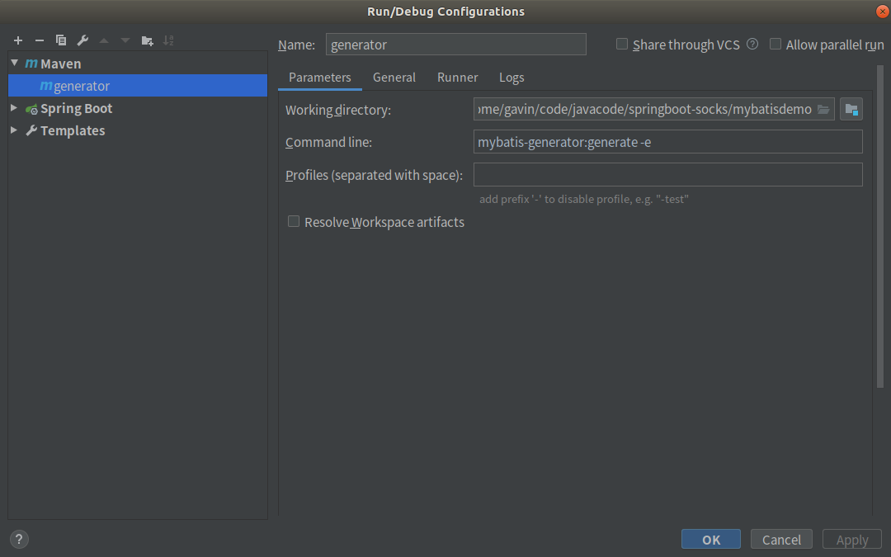  


⑤启动Mybatis Generator ，自动在dao、entity、mapper包下生成代码  

  


⑥Mybatis Generator运行完成之后如下图：  

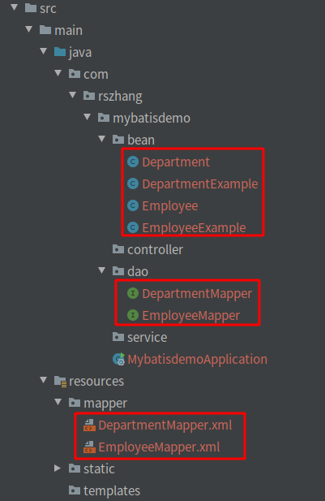  


### Springboot配置文件  

application.yml内容如下：  

```yaml
server:
  port: 8081

spring:
  datasource:
    url: jdbc:mysql://127.0.0.1:3307/mybatis?allowMultiQueries=true
    username: root
    password: 123456
    driver-class-name: com.mysql.cj.jdbc.Driver


logging:
  level:
    com:
      rszhang:
        mybatisdemo:
          controller: info
          dao: debug

mybatis:
  config-location: classpath:mybatis-config.xml
  mapper-locations: classpath:mapper/*.xml
```

在SpringBoot启动文件MybatisdemoApplication.java里开启mapper扫描  

```java
package com.rszhang.mybatisdemo;

import org.mybatis.spring.annotation.MapperScan;
import org.springframework.boot.SpringApplication;
import org.springframework.boot.autoconfigure.SpringBootApplication;

@SpringBootApplication
@MapperScan("com.rszhang.mybatisdemo.dao")
public class MybatisdemoApplication {

    public static void main(String[] args) {
        SpringApplication.run(MybatisdemoApplication.class, args);
    }

}
```


## 修改Mapper映射  

①修改Employee.java，增加department属性  

```java
package com.rszhang.mybatisdemo.bean;

public class Employee {
    private Integer empId;

    private String empName;

    private String gender;

    private String email;

    private Integer dId;

    private Department department;

    public Integer getEmpId() {
        return empId;
    }

    public void setEmpId(Integer empId) {
        this.empId = empId;
    }

    public String getEmpName() {
        return empName;
    }

    public void setEmpName(String empName) {
        this.empName = empName == null ? null : empName.trim();
    }

    public String getGender() {
        return gender;
    }

    public void setGender(String gender) {
        this.gender = gender == null ? null : gender.trim();
    }

    public String getEmail() {
        return email;
    }

    public void setEmail(String email) {
        this.email = email == null ? null : email.trim();
    }

    public Integer getdId() {
        return dId;
    }

    public void setdId(Integer dId) {
        this.dId = dId;
    }

    public Department getDepartment() {
        return department;
    }

    public void setDepartment(Department department) {
        this.department = department;
    }
}
```


②修改EmployeeMapper.java，增加2个方法selectByExampleWithDept和selectByPrimaryKeyWithDept  

```java
package com.rszhang.mybatisdemo.dao;

import com.rszhang.mybatisdemo.bean.Employee;
import com.rszhang.mybatisdemo.bean.EmployeeExample;
import java.util.List;
import org.apache.ibatis.annotations.Param;

public interface EmployeeMapper {
    long countByExample(EmployeeExample example);

    int deleteByExample(EmployeeExample example);

    int deleteByPrimaryKey(Integer empId);

    int insert(Employee record);

    int insertSelective(Employee record);

    List<Employee> selectByExample(EmployeeExample example);

    Employee selectByPrimaryKey(Integer empId);

    List<Employee> selectByExampleWithDept(EmployeeExample example);

    Employee selectByPrimaryKeyWithDept(Integer empId);

    int updateByExampleSelective(@Param("record") Employee record, @Param("example") EmployeeExample example);

    int updateByExample(@Param("record") Employee record, @Param("example") EmployeeExample example);

    int updateByPrimaryKeySelective(Employee record);

    int updateByPrimaryKey(Employee record);
}
```

修改EmployeeMapper.xml，添加下图几个地方  

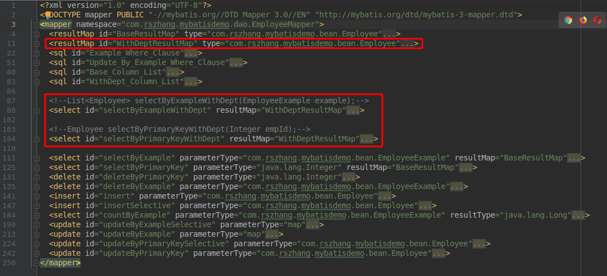  

