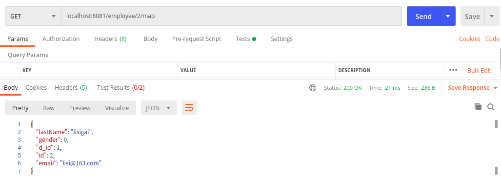

# SpringBoot整合MyBatis使用XML  

## 引入MyBatis  

### 通过SpringInitializr创建SpringBoot应用时引入Mybatis  

  


### 通过添加依赖来引入MyBatis  

> 如果不是通过SpringInitializr创建SpingBoot应用时引入MyBatis的话，后期可以通过在pom文件中添加依赖来引入Mybatis   

``` xml
<!--添加Web依赖 -->
<dependency>
    <groupId>org.springframework.boot</groupId>
    <artifactId>spring-boot-starter-web</artifactId>
</dependency>
<!--添加Mybatis依赖 -->
<dependency>
    <groupId>org.mybatis.spring.boot</groupId>
    <artifactId>mybatis-spring-boot-starter</artifactId>
    <version>2.1.3</version>
</dependency>
<!--添加MySQL驱动依赖 -->
<dependency>
    <groupId>mysql</groupId>
    <artifactId>mysql-connector-java</artifactId>
    <scope>runtime</scope>
</dependency>
```


## 准备数据库  

数据库使用MySQL5.7，创建2张表employee和department，建表语句如下：  

```sql
DROP TABLE IF EXISTS `employee`;
CREATE TABLE `employee` (
  `id` int(11) NOT NULL AUTO_INCREMENT,
  `lastName` varchar(255) DEFAULT NULL,
  `email` varchar(255) DEFAULT NULL,
  `gender` int(2) DEFAULT NULL,
  `d_id` int(11) DEFAULT NULL,
  PRIMARY KEY (`id`)
) ENGINE=InnoDB AUTO_INCREMENT=1 DEFAULT CHARSET=utf8;

DROP TABLE IF EXISTS `department`;
CREATE TABLE `department` (
  `id` int(11) NOT NULL AUTO_INCREMENT,
  `departmentName` varchar(255) DEFAULT NULL,
  PRIMARY KEY (`id`)
) ENGINE=InnoDB AUTO_INCREMENT=1 DEFAULT CHARSET=utf8;
```

执行完建表语句之后，数据库表应该如下：

employee表

| id   | lastName | email | gender | d_id |
| ---- | -------- | ----- | ------ | ---- |
|      |          |       |        |      |

department表

| id   | departmentName |
| ---- | -------------- |
|      |                |


## 初始工程结构图及配置文件  

  

application.yml如下：  

```yaml
server:
  port: 8081

spring:
  datasource:
    url: jdbc:mysql://127.0.0.1:3307/mybatis
    username: root
    password: 123456
    driver-class-name: com.mysql.cj.jdbc.Driver

logging:
  level:
    com:
      rszhang:
        mybatisxml:
          controller: info
          mapper: debug

mybatis:
  config-location: classpath:mybatis/mybatis-config.xml
  mapper-locations: classpath:mybatis/mapper/*.xml
```

mybatis-config.xml如下：  

```xml
<?xml version="1.0" encoding="UTF-8" ?>
<!DOCTYPE configuration
        PUBLIC "-//mybatis.org//DTD Config 3.0//EN"
        "http://mybatis.org/dtd/mybatis-3-config.dtd">
<configuration>

    <!--开启驼峰命名映射-->
    <settings>
        <setting name="mapUnderscoreToCamelCase" value="true"/>
    </settings>

</configuration>
```


## 编写bean

  

Department.java如下：

```java
package com.rszhang.mybatisxml.bean;

public class Department {

    private Integer id;
    private String departmentName;

    public Integer getId() {
        return id;
    }

    public void setId(Integer id) {
        this.id = id;
    }

    public String getDepartmentName() {
        return departmentName;
    }

    public void setDepartmentName(String departmentName) {
        this.departmentName = departmentName;
    }

    @Override
    public String toString() {
        return "Departement{" +
                "id=" + id +
                ", departmentName='" + departmentName + '\'' +
                '}';
    }
}
```

Employee.java如下：

```java
package com.rszhang.mybatisxml.bean;

public class Employee {

    private Integer id;
    private String lastName;
    private Integer gender;
    private String email;
    private Integer dId;

    public Integer getId() {
        return id;
    }

    public void setId(Integer id) {
        this.id = id;
    }

    public String getLastName() {
        return lastName;
    }

    public void setLastName(String lastName) {
        this.lastName = lastName;
    }

    public Integer getGender() {
        return gender;
    }

    public void setGender(Integer gender) {
        this.gender = gender;
    }

    public String getEmail() {
        return email;
    }

    public void setEmail(String email) {
        this.email = email;
    }

    public Integer getdId() {
        return dId;
    }

    public void setdId(Integer dId) {
        this.dId = dId;
    }

    @Override
    public String toString() {
        return "Employee{" +
                "id=" + id +
                ", lastName='" + lastName + '\'' +
                ", gender=" + gender +
                ", email='" + email + '\'' +
                ", dId=" + dId +
                '}';
    }
}

```


## 基本的增删改查  

### 编写mapper和sql映射文件(xml)

  

EmployeeMapper.java如下：

```java
package com.rszhang.mybatisxml.mapper;

import com.rszhang.mybatisxml.bean.Employee;
import org.springframework.stereotype.Repository;

@Repository
public interface EmployeeMapper {

    // 根据 id 查询 Employee
    public Employee getEmployeeById(Integer id);

    // 添加一个新的 Employee
    public void addEmployee(Employee employee);

    // 修改一个Employee
    public void updateEmployee(Employee employee);

    // 删除一个Employee
    public void deleteEmployeeById(Integer id);
}
```

EmployeeMapper.xml如下：  

```xml
<?xml version="1.0" encoding="UTF-8" ?>
<!DOCTYPE mapper
        PUBLIC "-//mybatis.org//DTD Mapper 3.0//EN"
        "http://mybatis.org/dtd/mybatis-3-mapper.dtd">
<mapper namespace="com.rszhang.mybatisxml.mapper.EmployeeMapper">

    <!--public Employee getEmployeeById(Integer id);-->
    <select id="getEmployeeById" resultType="com.rszhang.mybatisxml.bean.Employee">
        SELECT * FROM employee where id = #{id}
    </select>

    <!--public void addEmployee(Employee employee);-->
    <!--parameterType: 指定参数类型。可以省略不配置-->
    <insert id="addEmployee" parameterType="com.rszhang.mybatisxml.bean.Employee">
        INSERT INTO employee (lastName, email, gender, d_id) VALUES (#{lastName}, #{email}, #{gender}, #{dId})
    </insert>

    <!--public void updateEmployee(Employee employee);-->
    <update id="updateEmployee">
        UPDATE employee SET lastName=#{lastName}, email=#{email}, gender=#{gender}, d_id=#{dId} WHERE id=#{id}
    </update>

    <!--public void deleteEmployeeById(Integer id);-->
    <delete id="deleteEmployeeById">
        DELETE FROM employee WHERE id = #{id}
    </delete>

</mapper>
```

### 给启动类添加mapper扫描  

  

MybatisxmlApplication.java如下:  

```  java
package com.rszhang.mybatisxml;

import org.mybatis.spring.annotation.MapperScan;
import org.springframework.boot.SpringApplication;
import org.springframework.boot.autoconfigure.SpringBootApplication;

@SpringBootApplication
@MapperScan("com.rszhang.mybatisxml.mapper")
public class MybatisxmlApplication {

    public static void main(String[] args) {
        SpringApplication.run(MybatisxmlApplication.class, args);
    }

}
```

### 编写controller类    

> 因为逻辑比较简单，直接从controller里调用mapper了，省略了service层

  

EmployeeController.java如下：  

``` java
package com.rszhang.mybatisxml.controller;

import com.rszhang.mybatisxml.bean.Employee;
import com.rszhang.mybatisxml.mapper.EmployeeMapper;
import org.slf4j.Logger;
import org.slf4j.LoggerFactory;
import org.springframework.beans.factory.annotation.Autowired;
import org.springframework.web.bind.annotation.*;

@RestController
public class EmployeeController {
    Logger logger = LoggerFactory.getLogger(EmployeeController.class);

    @Autowired
    EmployeeMapper employeeMapper;

    @GetMapping("/employee/{id}")
    public Employee getEmployee(@PathVariable("id") Integer id) {
        return employeeMapper.getEmployeeById(id);
    }

    @PostMapping("/employee")
    public void addEmployee(Employee employee) {
        employeeMapper.addEmployee(employee);
    }

    @PutMapping("/employee")
    public void updateEmployee(Employee employee) {
        employeeMapper.updateEmployee(employee);
    }

    @DeleteMapping("/employee/{id}")
    public void deleteEmployee(@PathVariable("id") Integer id) {
        employeeMapper.deleteEmployeeById(id);
    }
}
```

### 使用postman验证增删改查  

#### 查询  

  


#### 增加  

  


#### 修改  


  

#### 删除  

  

  


## 获取增删改操作对数据库的影响条数  

在上文中，增删改都没有返回值，也就不知道操作到底成功没有成功，成功操作了几条数据，这个问题其实很好解决，就是在mappper接口里把`void`改成返回值类型就可以了。返回值类型可以选择int/Integer、long/Long、boolean/Boolean。  

修改EmployeeMapper.java  

```java
package com.rszhang.mybatisxml.mapper;

import com.rszhang.mybatisxml.bean.Employee;
import org.springframework.stereotype.Repository;

@Repository
public interface EmployeeMapper {

    // 根据 id 查询 Employee
    public Employee getEmployeeById(Integer id);

    // 添加一个新的 Employee
    public Integer addEmployee(Employee employee);

    // 修改一个Employee
    public Long updateEmployee(Employee employee);

    // 删除一个Employee
    public Boolean deleteEmployeeById(Integer id);
}
```

修改EmployeeController.java  

```java
package com.rszhang.mybatisxml.controller;

import com.rszhang.mybatisxml.bean.Employee;
import com.rszhang.mybatisxml.mapper.EmployeeMapper;
import org.slf4j.Logger;
import org.slf4j.LoggerFactory;
import org.springframework.beans.factory.annotation.Autowired;
import org.springframework.web.bind.annotation.*;

@RestController
public class EmployeeController {
    Logger logger = LoggerFactory.getLogger(EmployeeController.class);

    @Autowired
    EmployeeMapper employeeMapper;

    @GetMapping("/employee/{id}")
    public Employee getEmployee(@PathVariable("id") Integer id) {
        return employeeMapper.getEmployeeById(id);
    }

    @PostMapping("/employee")
    public Integer addEmployee(Employee employee) {
        return employeeMapper.addEmployee(employee);
    }

    @PutMapping("/employee")
    public Long updateEmployee(Employee employee) {
        return employeeMapper.updateEmployee(employee);
    }

    @DeleteMapping("/employee/{id}")
    public Boolean deleteEmployee(@PathVariable("id") Integer id) {
        return employeeMapper.deleteEmployeeById(id);
    }
    
}
```

再次使用postman验证增删改

增加  

  

修改  

  

删除  

  


## 获取自增主键的主键值  

* useGeneratedKeys:设置为true，即为使用主键自增。

* keyProperty: 使用哪个属性保存主键的值  

> 具体实现原理是在底层使用了JDBC的PreparedStatement.RETURN_GENERATED_KEYS，比如：
>
> ```java
> PreparedStatement ps = connection.prepareStatement("sql", PreparedStatement.RETURN_GENERATED_KEYS);
> ps.executeUpdate();
> ps.getGeneratedKeys();
> ```

修改EmployeeMapper.xml(修改addEmployee)  

```xml
<?xml version="1.0" encoding="UTF-8" ?>
<!DOCTYPE mapper
        PUBLIC "-//mybatis.org//DTD Mapper 3.0//EN"
        "http://mybatis.org/dtd/mybatis-3-mapper.dtd">
<mapper namespace="com.rszhang.mybatisxml.mapper.EmployeeMapper">

    <!--public Employee getEmployeeById(Integer id);-->
    <select id="getEmployeeById" resultType="com.rszhang.mybatisxml.bean.Employee">
        SELECT * FROM employee where id = #{id}
    </select>

    <!--public void addEmployee(Employee employee);-->
    <!--parameterType: 指定参数类型。可以省略不配置-->
    <!--useGeneratedKeys:设置为true，即为使用主键自增。  keyProperty: 使用哪个属性保存主键的值-->
    <insert id="addEmployee" parameterType="com.rszhang.mybatisxml.bean.Employee"
            useGeneratedKeys="true" keyProperty="id">
        INSERT INTO employee (lastName, email, gender, d_id) VALUES (#{lastName}, #{email}, #{gender}, #{dId})
    </insert>

    <!--public void updateEmployee(Employee employee);-->
    <update id="updateEmployee">
        UPDATE employee SET lastName=#{lastName}, email=#{email}, gender=#{gender}, d_id=#{dId} WHERE id=#{id}
    </update>

    <!--public void deleteEmployeeById(Integer id);-->
    <delete id="deleteEmployeeById">
        DELETE FROM employee WHERE id = #{id}
    </delete>

</mapper>
```

修改EmployeeController.java(修改addEmployee)  

```java
package com.rszhang.mybatisxml.controller;

import com.rszhang.mybatisxml.bean.Employee;
import com.rszhang.mybatisxml.mapper.EmployeeMapper;
import org.slf4j.Logger;
import org.slf4j.LoggerFactory;
import org.springframework.beans.factory.annotation.Autowired;
import org.springframework.web.bind.annotation.*;

/**
 * @author : Flylater
 * @version : 1.0
 * @date : 2020/7/15
 */
@RestController
public class EmployeeController {
    Logger logger = LoggerFactory.getLogger(EmployeeController.class);

    @Autowired
    EmployeeMapper employeeMapper;

    @GetMapping("/employee/{id}")
    public Employee getEmployee(@PathVariable("id") Integer id) {
        return employeeMapper.getEmployeeById(id);
    }

    @PostMapping("/employee")
    public Employee addEmployee(Employee employee) {
        employeeMapper.addEmployee(employee);
        return employee;
    }

    @PutMapping("/employee")
    public Long updateEmployee(Employee employee) {
        return employeeMapper.updateEmployee(employee);
    }

    @DeleteMapping("/employee/{id}")
    public Boolean deleteEmployee(@PathVariable("id") Integer id) {
        return employeeMapper.deleteEmployeeById(id);
    }

}

```

使用postman验证增加employee  

  


## 参数传递  


### 单个普通类型的参数  

普通类型：基本/包装 + String  

MyBatis可直接使用这个参数，不需要经过任何处理。取值：#{普通类型的参数}  


### 多个参数  

当有多个参数传进去时，可以使用param1、param2、param3...来进行传参  

举例：添加可以使用 id 和 lastName 一起来查找 Employee  

修改EmployeeMapper.java  

```java
package com.rszhang.mybatisxml.mapper;

import com.rszhang.mybatisxml.bean.Employee;
import org.springframework.stereotype.Repository;

@Repository
public interface EmployeeMapper {

    // 根据 id 查询 Employee
    public Employee getEmployeeById(Integer id);

    // 添加一个新的 Employee
    public Integer addEmployee(Employee employee);

    // 修改一个Employee
    public Long updateEmployee(Employee employee);

    // 删除一个Employee
    public Boolean deleteEmployeeById(Integer id);

    // 通过 id 和 lastName 查找Employee
    public Employee getEmployeeByIdAndLastName(Integer id, String lastName);
}
```

修改EmployeeMapper.xml  

```xml
<?xml version="1.0" encoding="UTF-8" ?>
<!DOCTYPE mapper
        PUBLIC "-//mybatis.org//DTD Mapper 3.0//EN"
        "http://mybatis.org/dtd/mybatis-3-mapper.dtd">
<mapper namespace="com.rszhang.mybatisxml.mapper.EmployeeMapper">

    <!--public Employee getEmployeeById(Integer id);-->
    <select id="getEmployeeById" resultType="com.rszhang.mybatisxml.bean.Employee">
        SELECT * FROM employee where id = #{id}
    </select>

    <!--public void addEmployee(Employee employee);-->
    <!--parameterType: 指定参数类型。可以省略不配置-->
    <!--useGeneratedKeys:设置为true，即为使用主键自增。  keyProperty: 使用哪个属性保存主键的值-->
    <insert id="addEmployee" parameterType="com.rszhang.mybatisxml.bean.Employee"
            useGeneratedKeys="true" keyProperty="id">
        INSERT INTO employee (lastName, email, gender, d_id) VALUES (#{lastName}, #{email}, #{gender}, #{dId})
    </insert>

    <!--public void updateEmployee(Employee employee);-->
    <update id="updateEmployee">
        UPDATE employee SET lastName=#{lastName}, email=#{email}, gender=#{gender}, d_id=#{dId} WHERE id=#{id}
    </update>

    <!--public void deleteEmployeeById(Integer id);-->
    <delete id="deleteEmployeeById">
        DELETE FROM employee WHERE id = #{id}
    </delete>

    <!--public Employee getEmployeeByIdAndLastName(Integer id, String lastName);-->
    <select id="getEmployeeByIdAndLastName" resultType="com.rszhang.mybatisxml.bean.Employee">
        SELECT id, lastName, email, gender, d_id FROM employee WHERE id=#{param1} and lastName=#{param2}
    </select>

</mapper>
```

修改EmployeeController.java  

```java
package com.rszhang.mybatisxml.controller;

import com.rszhang.mybatisxml.bean.Employee;
import com.rszhang.mybatisxml.mapper.EmployeeMapper;
import org.slf4j.Logger;
import org.slf4j.LoggerFactory;
import org.springframework.beans.factory.annotation.Autowired;
import org.springframework.web.bind.annotation.*;

@RestController
public class EmployeeController {
    Logger logger = LoggerFactory.getLogger(EmployeeController.class);

    @Autowired
    EmployeeMapper employeeMapper;

    @GetMapping("/employee/{id}")
    public Employee getEmployee(@PathVariable("id") Integer id) {
        return employeeMapper.getEmployeeById(id);
    }

    @PostMapping("/employee")
    public Employee addEmployee(Employee employee) {
        employeeMapper.addEmployee(employee);
        return employee;
    }

    @PutMapping("/employee")
    public Long updateEmployee(Employee employee) {
        return employeeMapper.updateEmployee(employee);
    }

    @DeleteMapping("/employee/{id}")
    public Boolean deleteEmployee(@PathVariable("id") Integer id) {
        return employeeMapper.deleteEmployeeById(id);
    }

    @GetMapping("/employee/{id}/{lastName}")
    public Employee getEmployee(@PathVariable("id") Integer id,
                                @PathVariable("lastName") String lastName) {
        return employeeMapper.getEmployeeByIdAndLastName(id, lastName);
    }

}
```

使用postman进行验证  

  


### POJO  

当参数属于业务POJO时，可以直接传递POJO。 取值：#{POJO的属性名}  


### Map  

其实当不是传入单个参数时，Mybatis都将多个参数封装成Map。同时我们也可以直接自己封装多个参数为Map，直接传递。取值：#{封装Map时使用的key}  

举例：添加使用Map来查找 Employee  

修改EmployeeMapper.java  

```java
package com.rszhang.mybatisxml.mapper;

import com.rszhang.mybatisxml.bean.Employee;
import org.springframework.stereotype.Repository;

import java.util.Map;

@Repository
public interface EmployeeMapper {

    // 根据 id 查询 Employee
    public Employee getEmployeeById(Integer id);

    // 添加一个新的 Employee
    public Integer addEmployee(Employee employee);

    // 修改一个Employee
    public Long updateEmployee(Employee employee);

    // 删除一个Employee
    public Boolean deleteEmployeeById(Integer id);

    // 通过 id 和 lastName 查找 Employee
    public Employee getEmployeeByIdAndLastName(Integer id, String lastName);

    // 通过 Map 查找 Employee
    public Employee getEmployeeByMap(Map<String, Object> map);
}
```

修改EmployeeMapper.xml  

```xml
<?xml version="1.0" encoding="UTF-8" ?>
<!DOCTYPE mapper
        PUBLIC "-//mybatis.org//DTD Mapper 3.0//EN"
        "http://mybatis.org/dtd/mybatis-3-mapper.dtd">
<mapper namespace="com.rszhang.mybatisxml.mapper.EmployeeMapper">

    <!--public Employee getEmployeeById(Integer id);-->
    <select id="getEmployeeById" resultType="com.rszhang.mybatisxml.bean.Employee">
        SELECT * FROM employee where id = #{id}
    </select>

    <!--public void addEmployee(Employee employee);-->
    <!--parameterType: 指定参数类型。可以省略不配置-->
    <!--useGeneratedKeys:设置为true，即为使用主键自增。  keyProperty: 使用哪个属性保存主键的值-->
    <insert id="addEmployee" parameterType="com.rszhang.mybatisxml.bean.Employee"
            useGeneratedKeys="true" keyProperty="id">
        INSERT INTO employee (lastName, email, gender, d_id) VALUES (#{lastName}, #{email}, #{gender}, #{dId})
    </insert>

    <!--public void updateEmployee(Employee employee);-->
    <update id="updateEmployee">
        UPDATE employee SET lastName=#{lastName}, email=#{email}, gender=#{gender}, d_id=#{dId} WHERE id=#{id}
    </update>

    <!--public void deleteEmployeeById(Integer id);-->
    <delete id="deleteEmployeeById">
        DELETE FROM employee WHERE id = #{id}
    </delete>

    <!--public Employee getEmployeeByIdAndLastName(Integer id, String lastName);-->
    <select id="getEmployeeByIdAndLastName" resultType="com.rszhang.mybatisxml.bean.Employee">
        SELECT id, lastName, email, gender, d_id FROM employee WHERE id=#{param1} and lastName=#{param2}
    </select>

    <!--public Employee getEmployeeByMap(Map<String, Object> map);-->
    <select id="getEmployeeByMap" resultType="com.rszhang.mybatisxml.bean.Employee">
        SELECT id, lastName, email, gender, d_id FROM employee
        WHERE id=#{id} and lastName=#{lastName} and gender=#{gender}
    </select>

</mapper>
```

修改EmployeeController.java  

```java
package com.rszhang.mybatisxml.controller;

import com.rszhang.mybatisxml.bean.Employee;
import com.rszhang.mybatisxml.mapper.EmployeeMapper;
import org.slf4j.Logger;
import org.slf4j.LoggerFactory;
import org.springframework.beans.factory.annotation.Autowired;
import org.springframework.web.bind.annotation.*;

import java.util.HashMap;
import java.util.Map;

@RestController
public class EmployeeController {
    Logger logger = LoggerFactory.getLogger(EmployeeController.class);

    @Autowired
    EmployeeMapper employeeMapper;

    @GetMapping("/employee/{id}")
    public Employee getEmployee(@PathVariable("id") Integer id) {
        return employeeMapper.getEmployeeById(id);
    }

    @PostMapping("/employee")
    public Employee addEmployee(Employee employee) {
        employeeMapper.addEmployee(employee);
        return employee;
    }

    @PutMapping("/employee")
    public Long updateEmployee(Employee employee) {
        return employeeMapper.updateEmployee(employee);
    }

    @DeleteMapping("/employee/{id}")
    public Boolean deleteEmployee(@PathVariable("id") Integer id) {
        return employeeMapper.deleteEmployeeById(id);
    }

    @GetMapping("/employee/{id}/{lastName}")
    public Employee getEmployee(@PathVariable("id") Integer id,
                                @PathVariable("lastName") String lastName) {
        return employeeMapper.getEmployeeByIdAndLastName(id, lastName);
    }

    @GetMapping("/employee/{id}/{lastName}/{gender}")
    public Employee getEmployee(@PathVariable("id") Integer id,
                                @PathVariable("lastName") String lastName,
                                @PathVariable("gender") Integer gender) {
        Map<String, Object> map = new HashMap<>();
        map.put("id", id);
        map.put("lastName", lastName);
        map.put("gender", gender);
        return employeeMapper.getEmployeeByMap(map);
    }

}
```


### Collection/Array(集合/数组)  

会被MyBatis封装成Map传入，Collection对应的key是collection，Array对应的key是array。如果确定是List集合，key还可以是list。取值： Array:#{array}  Collection(List/Set):#{collection}  List:#{collection/list}


### 命名参数  

使用@Param给参数起个名字，MyBatis将参数封装进Map的时候key就是使用@Param指定的名字。取值：#{指定的名字/param1...paramn}

举例：修改EmployeeMapper.java  

```java
package com.rszhang.mybatisxml.mapper;

import com.rszhang.mybatisxml.bean.Employee;
import org.apache.ibatis.annotations.Param;
import org.springframework.stereotype.Repository;

import java.util.Map;

@Repository
public interface EmployeeMapper {

    // 根据 id 查询 Employee
    public Employee getEmployeeById(Integer id);

    // 添加一个新的 Employee
    public Integer addEmployee(Employee employee);

    // 修改一个Employee
    public Long updateEmployee(Employee employee);

    // 删除一个Employee
    public Boolean deleteEmployeeById(Integer id);

    // 通过 id 和 lastName 查找 Employee
    public Employee getEmployeeByIdAndLastName(@Param("id") Integer id,
                                               @Param("lastName") String lastName);

    // 通过 Map 查找 Employee
    public Employee getEmployeeByMap(Map<String, Object> map);
}
```

修改EmployeeMapper.xml  

```xml
<?xml version="1.0" encoding="UTF-8" ?>
<!DOCTYPE mapper
        PUBLIC "-//mybatis.org//DTD Mapper 3.0//EN"
        "http://mybatis.org/dtd/mybatis-3-mapper.dtd">
<mapper namespace="com.rszhang.mybatisxml.mapper.EmployeeMapper">

    <!--public Employee getEmployeeById(Integer id);-->
    <select id="getEmployeeById" resultType="com.rszhang.mybatisxml.bean.Employee">
        SELECT * FROM employee where id = #{id}
    </select>

    <!--public void addEmployee(Employee employee);-->
    <!--parameterType: 指定参数类型。可以省略不配置-->
    <!--useGeneratedKeys:设置为true，即为使用主键自增。  keyProperty: 使用哪个属性保存主键的值-->
    <insert id="addEmployee" parameterType="com.rszhang.mybatisxml.bean.Employee"
            useGeneratedKeys="true" keyProperty="id">
        INSERT INTO employee (lastName, email, gender, d_id) VALUES (#{lastName}, #{email}, #{gender}, #{dId})
    </insert>

    <!--public void updateEmployee(Employee employee);-->
    <update id="updateEmployee">
        UPDATE employee SET lastName=#{lastName}, email=#{email}, gender=#{gender}, d_id=#{dId} WHERE id=#{id}
    </update>

    <!--public void deleteEmployeeById(Integer id);-->
    <delete id="deleteEmployeeById">
        DELETE FROM employee WHERE id = #{id}
    </delete>

    <!--public Employee getEmployeeByIdAndLastName(Integer id, String lastName);-->
    <select id="getEmployeeByIdAndLastName" resultType="com.rszhang.mybatisxml.bean.Employee">
        SELECT id, lastName, email, gender, d_id FROM employee WHERE id=#{id} and lastName=#{lastName}
    </select>

    <!--public Employee getEmployeeByMap(Map<String, Object> map);-->
    <select id="getEmployeeByMap" resultType="com.rszhang.mybatisxml.bean.Employee">
        SELECT id, lastName, email, gender, d_id FROM employee
        WHERE id=#{id} and lastName=#{lastName} and gender=#{gender}
    </select>

</mapper>
```


### ${key}  

MyBatis可使用#{key}和${key}获取参数  

* #{key}：预编译到SQL中。安全。
* ${key}：拼接到SQL中。有SQL注入的问题。  

能用#{key}取值就优先使用#{key}，#{key}解决不了的才使用${key}。例如：原生JDBC不支持占位符的地方使用${key}，列名、表名等。  


## Select  

### 查询单行数据返回单个对象 

如上文基本增删改查中的getEmployeeById  


### 查询多行数据返回多个对象的集合  

resultType和查询单行数据返回单个对象一致，填写对象的全类名  

举例：添加getEmployees  

EmployeeMapper.java  

```java
package com.rszhang.mybatisxml.mapper;

import com.rszhang.mybatisxml.bean.Employee;
import org.apache.ibatis.annotations.Param;
import org.springframework.stereotype.Repository;

import java.util.List;
import java.util.Map;

@Repository
public interface EmployeeMapper {

    // 根据 id 查询 Employee
    public Employee getEmployeeById(Integer id);

    // 添加一个新的 Employee
    public Integer addEmployee(Employee employee);

    // 修改一个Employee
    public Long updateEmployee(Employee employee);

    // 删除一个Employee
    public Boolean deleteEmployeeById(Integer id);

    // 通过 id 和 lastName 查找 Employee
    public Employee getEmployeeByIdAndLastName(@Param("id") Integer id,
                                               @Param("lastName") String lastName);

    // 通过 Map 查找 Employee
    public Employee getEmployeeByMap(Map<String, Object> map);

    // 查询 Employee 的集合
    public List<Employee> getEmployees();
}
```

EmployeeMapper.xml  

```xml
<?xml version="1.0" encoding="UTF-8" ?>
<!DOCTYPE mapper
        PUBLIC "-//mybatis.org//DTD Mapper 3.0//EN"
        "http://mybatis.org/dtd/mybatis-3-mapper.dtd">
<mapper namespace="com.rszhang.mybatisxml.mapper.EmployeeMapper">

    <!--public Employee getEmployeeById(Integer id);-->
    <select id="getEmployeeById" resultType="com.rszhang.mybatisxml.bean.Employee">
        SELECT * FROM employee where id = #{id}
    </select>

    <!--public void addEmployee(Employee employee);-->
    <!--parameterType: 指定参数类型。可以省略不配置-->
    <!--useGeneratedKeys:设置为true，即为使用主键自增。  keyProperty: 使用哪个属性保存主键的值-->
    <insert id="addEmployee" parameterType="com.rszhang.mybatisxml.bean.Employee"
            useGeneratedKeys="true" keyProperty="id">
        INSERT INTO employee (lastName, email, gender, d_id) VALUES (#{lastName}, #{email}, #{gender}, #{dId})
    </insert>

    <!--public void updateEmployee(Employee employee);-->
    <update id="updateEmployee">
        UPDATE employee SET lastName=#{lastName}, email=#{email}, gender=#{gender}, d_id=#{dId} WHERE id=#{id}
    </update>

    <!--public void deleteEmployeeById(Integer id);-->
    <delete id="deleteEmployeeById">
        DELETE FROM employee WHERE id = #{id}
    </delete>

    <!--public Employee getEmployeeByIdAndLastName(Integer id, String lastName);-->
    <select id="getEmployeeByIdAndLastName" resultType="com.rszhang.mybatisxml.bean.Employee">
        SELECT id, lastName, email, gender, d_id FROM employee WHERE id=#{id} and lastName=#{lastName}
    </select>

    <!--public Employee getEmployeeByMap(Map<String, Object> map);-->
    <select id="getEmployeeByMap" resultType="com.rszhang.mybatisxml.bean.Employee">
        SELECT id, lastName, email, gender, d_id FROM employee
        WHERE id=#{id} and lastName=#{lastName} and gender=#{gender}
    </select>

    <!--public List<Employee> getEmployees();-->
    <select id="getEmployees" resultType="com.rszhang.mybatisxml.bean.Employee">
        SELECT id, lastName, email, gender, d_id FROM employee
    </select>

</mapper>
```

EmployeeController.java  

```java
package com.rszhang.mybatisxml.controller;

import com.rszhang.mybatisxml.bean.Employee;
import com.rszhang.mybatisxml.mapper.EmployeeMapper;
import org.slf4j.Logger;
import org.slf4j.LoggerFactory;
import org.springframework.beans.factory.annotation.Autowired;
import org.springframework.web.bind.annotation.*;

import java.util.HashMap;
import java.util.List;
import java.util.Map;

@RestController
public class EmployeeController {
    Logger logger = LoggerFactory.getLogger(EmployeeController.class);

    @Autowired
    EmployeeMapper employeeMapper;

    @GetMapping("/employee/{id}")
    public Employee getEmployee(@PathVariable("id") Integer id) {
        return employeeMapper.getEmployeeById(id);
    }

    @PostMapping("/employee")
    public Employee addEmployee(Employee employee) {
        employeeMapper.addEmployee(employee);
        return employee;
    }

    @PutMapping("/employee")
    public Long updateEmployee(Employee employee) {
        return employeeMapper.updateEmployee(employee);
    }

    @DeleteMapping("/employee/{id}")
    public Boolean deleteEmployee(@PathVariable("id") Integer id) {
        return employeeMapper.deleteEmployeeById(id);
    }

    @GetMapping("/employee/{id}/{lastName}")
    public Employee getEmployee(@PathVariable("id") Integer id,
                                @PathVariable("lastName") String lastName) {
        return employeeMapper.getEmployeeByIdAndLastName(id, lastName);
    }

    @GetMapping("/employee/{id}/{lastName}/{gender}")
    public Employee getEmployee(@PathVariable("id") Integer id,
                                @PathVariable("lastName") String lastName,
                                @PathVariable("gender") Integer gender) {
        Map<String, Object> map = new HashMap<>();
        map.put("id", id);
        map.put("lastName", lastName);
        map.put("gender", gender);
        return employeeMapper.getEmployeeByMap(map);
    }

    @GetMapping("/employee")
    public List<Employee> geEmployees() {
        return employeeMapper.getEmployees();
    }

}
```

使用postman验证结果

  


### 查询单行数据返回一个Map  

resultType为java.util.Map、java.util.HashMap...  

举例：添加getEmployeeByIdReturnMap  

EmployeeMapper.java  

```java
package com.rszhang.mybatisxml.mapper;

import com.rszhang.mybatisxml.bean.Employee;
import org.apache.ibatis.annotations.Param;
import org.springframework.stereotype.Repository;

import java.util.List;
import java.util.Map;

/**
 * @author : Flylater
 * @version : 1.0
 * @date : 2020/7/15
 */
@Repository
public interface EmployeeMapper {

    // 根据 id 查询 Employee
    public Employee getEmployeeById(Integer id);

    // 添加一个新的 Employee
    public Integer addEmployee(Employee employee);

    // 修改一个Employee
    public Long updateEmployee(Employee employee);

    // 删除一个Employee
    public Boolean deleteEmployeeById(Integer id);

    // 通过 id 和 lastName 查找 Employee
    public Employee getEmployeeByIdAndLastName(@Param("id") Integer id,
                                               @Param("lastName") String lastName);

    // 通过 Map 查找 Employee
    public Employee getEmployeeByMap(Map<String, Object> map);

    // 查询多个 Employee， 并返回一个集合
    public List<Employee> getEmployees();

    // 查询单个 Employee， 并返回一个Map
    public Map<String, Object> getEmployeeByIdReturnMap(Integer id);
}
```

EmployeeMapper.xml  

```xml
<?xml version="1.0" encoding="UTF-8" ?>
<!DOCTYPE mapper
        PUBLIC "-//mybatis.org//DTD Mapper 3.0//EN"
        "http://mybatis.org/dtd/mybatis-3-mapper.dtd">
<mapper namespace="com.rszhang.mybatisxml.mapper.EmployeeMapper">

    <!--public Employee getEmployeeById(Integer id);-->
    <select id="getEmployeeById" resultType="com.rszhang.mybatisxml.bean.Employee">
        SELECT * FROM employee where id = #{id}
    </select>

    <!--public void addEmployee(Employee employee);-->
    <!--parameterType: 指定参数类型。可以省略不配置-->
    <!--useGeneratedKeys:设置为true，即为使用主键自增。  keyProperty: 使用哪个属性保存主键的值-->
    <insert id="addEmployee" parameterType="com.rszhang.mybatisxml.bean.Employee"
            useGeneratedKeys="true" keyProperty="id">
        INSERT INTO employee (lastName, email, gender, d_id) VALUES (#{lastName}, #{email}, #{gender}, #{dId})
    </insert>

    <!--public void updateEmployee(Employee employee);-->
    <update id="updateEmployee">
        UPDATE employee SET lastName=#{lastName}, email=#{email}, gender=#{gender}, d_id=#{dId} WHERE id=#{id}
    </update>

    <!--public void deleteEmployeeById(Integer id);-->
    <delete id="deleteEmployeeById">
        DELETE FROM employee WHERE id = #{id}
    </delete>

    <!--public Employee getEmployeeByIdAndLastName(Integer id, String lastName);-->
    <select id="getEmployeeByIdAndLastName" resultType="com.rszhang.mybatisxml.bean.Employee">
        SELECT id, lastName, email, gender, d_id FROM employee WHERE id=#{id} and lastName=#{lastName}
    </select>

    <!--public Employee getEmployeeByMap(Map<String, Object> map);-->
    <select id="getEmployeeByMap" resultType="com.rszhang.mybatisxml.bean.Employee">
        SELECT id, lastName, email, gender, d_id FROM employee
        WHERE id=#{id} and lastName=#{lastName} and gender=#{gender}
    </select>

    <!--public List<Employee> getEmployees();-->
    <select id="getEmployees" resultType="com.rszhang.mybatisxml.bean.Employee">
        SELECT id, lastName, email, gender, d_id FROM employee
    </select>
    
    <!--public Map<String, Object> getEmployeeByIdReturnMap(Integer id);-->
    <select id="getEmployeeByIdReturnMap" resultType="java.util.HashMap">
        SELECT id, lastName, email, gender, d_id FROM employee where id = #{id}
    </select>

</mapper>
```

EmployeeController.java  

```java
package com.rszhang.mybatisxml.controller;

import com.rszhang.mybatisxml.bean.Employee;
import com.rszhang.mybatisxml.mapper.EmployeeMapper;
import org.slf4j.Logger;
import org.slf4j.LoggerFactory;
import org.springframework.beans.factory.annotation.Autowired;
import org.springframework.web.bind.annotation.*;

import java.util.HashMap;
import java.util.List;
import java.util.Map;

/**
 * @author : Flylater
 * @version : 1.0
 * @date : 2020/7/15
 */
@RestController
public class EmployeeController {
    Logger logger = LoggerFactory.getLogger(EmployeeController.class);

    @Autowired
    EmployeeMapper employeeMapper;

    @GetMapping("/employee/{id}")
    public Employee getEmployee(@PathVariable("id") Integer id) {
        return employeeMapper.getEmployeeById(id);
    }

    @PostMapping("/employee")
    public Employee addEmployee(Employee employee) {
        employeeMapper.addEmployee(employee);
        return employee;
    }

    @PutMapping("/employee")
    public Long updateEmployee(Employee employee) {
        return employeeMapper.updateEmployee(employee);
    }

    @DeleteMapping("/employee/{id}")
    public Boolean deleteEmployee(@PathVariable("id") Integer id) {
        return employeeMapper.deleteEmployeeById(id);
    }

    @GetMapping("/employee/{id}/{lastName}")
    public Employee getEmployee(@PathVariable("id") Integer id,
                                @PathVariable("lastName") String lastName) {
        return employeeMapper.getEmployeeByIdAndLastName(id, lastName);
    }

    @GetMapping("/employee/{id}/{lastName}/{gender}")
    public Employee getEmployee(@PathVariable("id") Integer id,
                                @PathVariable("lastName") String lastName,
                                @PathVariable("gender") Integer gender) {
        Map<String, Object> map = new HashMap<>();
        map.put("id", id);
        map.put("lastName", lastName);
        map.put("gender", gender);
        return employeeMapper.getEmployeeByMap(map);
    }

    @GetMapping("/employee")
    public List<Employee> geEmployees() {
        return employeeMapper.getEmployees();
    }

    @GetMapping("/employee/{id}/map")
    public Map<String, Object> getEmployeeByIdReturnMap(@PathVariable("id") Integer id) {
        return employeeMapper.getEmployeeByIdReturnMap(id);
    }

}
```

使用postman进行验证  

  


### 查询多行数据返回一个Map  

* mapper接口加上@MapKey注解，指定使用`对象`的哪个属性作为 Map 的 `key`

* resultType为对象的全类名  

举例：添加getEmployeesReturnMap  

EmployeeMapper.java  

```java
package com.rszhang.mybatisxml.mapper;

import com.rszhang.mybatisxml.bean.Employee;
import org.apache.ibatis.annotations.MapKey;
import org.apache.ibatis.annotations.Param;
import org.springframework.stereotype.Repository;

import java.util.List;
import java.util.Map;

@Repository
public interface EmployeeMapper {

    // 根据 id 查询 Employee
    public Employee getEmployeeById(Integer id);

    // 添加一个新的 Employee
    public Integer addEmployee(Employee employee);

    // 修改一个Employee
    public Long updateEmployee(Employee employee);

    // 删除一个Employee
    public Boolean deleteEmployeeById(Integer id);

    // 通过 id 和 lastName 查找 Employee
    public Employee getEmployeeByIdAndLastName(@Param("id") Integer id,
                                               @Param("lastName") String lastName);

    // 通过 Map 查找 Employee
    public Employee getEmployeeByMap(Map<String, Object> map);

    // 查询多个 Employee， 并返回一个集合
    public List<Employee> getEmployees();

    // 查询单个 Employee， 并返回一个Map
    public Map<String, Object> getEmployeeByIdReturnMap(Integer id);

    // 查询多个 Employee， 并返回一个Map
    @MapKey("id")  // 指定使用 对象 的哪个属性作为 Map 的 key。
    public Map<Integer, Employee> getEmployeesReturnMap();
}
```

EmployeeMapper.xml  

```xml
<?xml version="1.0" encoding="UTF-8" ?>
<!DOCTYPE mapper
        PUBLIC "-//mybatis.org//DTD Mapper 3.0//EN"
        "http://mybatis.org/dtd/mybatis-3-mapper.dtd">
<mapper namespace="com.rszhang.mybatisxml.mapper.EmployeeMapper">

    <!--public Employee getEmployeeById(Integer id);-->
    <select id="getEmployeeById" resultType="com.rszhang.mybatisxml.bean.Employee">
        SELECT * FROM employee where id = #{id}
    </select>

    <!--public void addEmployee(Employee employee);-->
    <!--parameterType: 指定参数类型。可以省略不配置-->
    <!--useGeneratedKeys:设置为true，即为使用主键自增。  keyProperty: 使用哪个属性保存主键的值-->
    <insert id="addEmployee" parameterType="com.rszhang.mybatisxml.bean.Employee"
            useGeneratedKeys="true" keyProperty="id">
        INSERT INTO employee (lastName, email, gender, d_id) VALUES (#{lastName}, #{email}, #{gender}, #{dId})
    </insert>

    <!--public void updateEmployee(Employee employee);-->
    <update id="updateEmployee">
        UPDATE employee SET lastName=#{lastName}, email=#{email}, gender=#{gender}, d_id=#{dId} WHERE id=#{id}
    </update>

    <!--public void deleteEmployeeById(Integer id);-->
    <delete id="deleteEmployeeById">
        DELETE FROM employee WHERE id = #{id}
    </delete>

    <!--public Employee getEmployeeByIdAndLastName(Integer id, String lastName);-->
    <select id="getEmployeeByIdAndLastName" resultType="com.rszhang.mybatisxml.bean.Employee">
        SELECT id, lastName, email, gender, d_id FROM employee WHERE id=#{id} and lastName=#{lastName}
    </select>

    <!--public Employee getEmployeeByMap(Map<String, Object> map);-->
    <select id="getEmployeeByMap" resultType="com.rszhang.mybatisxml.bean.Employee">
        SELECT id, lastName, email, gender, d_id FROM employee
        WHERE id=#{id} and lastName=#{lastName} and gender=#{gender}
    </select>

    <!--public List<Employee> getEmployees();-->
    <select id="getEmployees" resultType="com.rszhang.mybatisxml.bean.Employee">
        SELECT id, lastName, email, gender, d_id FROM employee
    </select>
    
    <!--public Map<String, Object> getEmployeeByIdReturnMap(Integer id);-->
    <select id="getEmployeeByIdReturnMap" resultType="java.util.HashMap">
        SELECT id, lastName, email, gender, d_id FROM employee where id = #{id}
    </select>
    
    <!--public Map<Integer, Employee> getEmployeesReturnMap();-->
    <select id="getEmployeesReturnMap" resultType="com.rszhang.mybatisxml.bean.Employee">
        SELECT id, lastName, email, gender, d_id FROM employee
    </select>

</mapper>
```

EmployeeController.java  

```java
package com.rszhang.mybatisxml.controller;

import com.rszhang.mybatisxml.bean.Employee;
import com.rszhang.mybatisxml.mapper.EmployeeMapper;
import org.slf4j.Logger;
import org.slf4j.LoggerFactory;
import org.springframework.beans.factory.annotation.Autowired;
import org.springframework.web.bind.annotation.*;

import java.util.HashMap;
import java.util.List;
import java.util.Map;

/**
 * @author : Flylater
 * @version : 1.0
 * @date : 2020/7/15
 */
@RestController
public class EmployeeController {
    Logger logger = LoggerFactory.getLogger(EmployeeController.class);

    @Autowired
    EmployeeMapper employeeMapper;

    @GetMapping("/employee/{id}")
    public Employee getEmployee(@PathVariable("id") Integer id) {
        return employeeMapper.getEmployeeById(id);
    }

    @PostMapping("/employee")
    public Employee addEmployee(Employee employee) {
        employeeMapper.addEmployee(employee);
        return employee;
    }

    @PutMapping("/employee")
    public Long updateEmployee(Employee employee) {
        return employeeMapper.updateEmployee(employee);
    }

    @DeleteMapping("/employee/{id}")
    public Boolean deleteEmployee(@PathVariable("id") Integer id) {
        return employeeMapper.deleteEmployeeById(id);
    }

    @GetMapping("/employee/{id}/{lastName}")
    public Employee getEmployee(@PathVariable("id") Integer id,
                                @PathVariable("lastName") String lastName) {
        return employeeMapper.getEmployeeByIdAndLastName(id, lastName);
    }

    @GetMapping("/employee/{id}/{lastName}/{gender}")
    public Employee getEmployee(@PathVariable("id") Integer id,
                                @PathVariable("lastName") String lastName,
                                @PathVariable("gender") Integer gender) {
        Map<String, Object> map = new HashMap<>();
        map.put("id", id);
        map.put("lastName", lastName);
        map.put("gender", gender);
        return employeeMapper.getEmployeeByMap(map);
    }

    @GetMapping("/employee")
    public List<Employee> geEmployees() {
        return employeeMapper.getEmployees();
    }

    @GetMapping("/employee/{id}/map")
    public Map<String, Object> getEmployeeByIdReturnMap(@PathVariable("id") Integer id) {
        return employeeMapper.getEmployeeByIdReturnMap(id);
    }

    @GetMapping("/employee/map")
    public Map<Integer, Employee> getEmployeesReturnMap() {
        return employeeMapper.getEmployeesReturnMap();
    }

}
```

使用postman验证结果  

  


### resultType自动映射  

1. autoMappingBehavior默认是PARTIAL，开启自动映射的功能，唯一的要求是列名和javaBean属性名一致。
2. 如果autoMappingBehavior设置为null则会取消自动映射
3. 数据库字段命名规范，如LAST_NAME；javaBean的属性名符合驼峰命名法，如lastName，将两者对应起来就需要开启自动驼峰命名映射，把mapUnderscoreToCamelCase设置为true  


### resultMap自定义映射  

使用自定义resultMap，来实现高级结果集映射  

* id  用于完成主键值的映射
* result  用于完成普通列的映射
* association  复杂的类型关联
* collection  复杂类型的集合  

#### 简单自定义映射

举例：

新增EmployeeMapperResultMap.java  

```java
package com.rszhang.mybatisxml.mapper;

import com.rszhang.mybatisxml.bean.Employee;
import org.springframework.stereotype.Repository;

@Repository
public interface EmployeeMapperResultMap {

    // 根据 id 查询 Employee
    public Employee getEmployeeById(Integer id);

}
```

新增EmployeeMapperResultMap.xml  

```xml
<?xml version="1.0" encoding="UTF-8" ?>
<!DOCTYPE mapper
        PUBLIC "-//mybatis.org//DTD Mapper 3.0//EN"
        "http://mybatis.org/dtd/mybatis-3-mapper.dtd">
<mapper namespace="com.rszhang.mybatisxml.mapper.EmployeeMapperResultMap">

    <!--public Employee getEmployeeById(Integer id);-->
    <select id="getEmployeeById" resultMap="MyEmployee">
        SELECT id, lastName, email, gender, d_id FROM employee WHERE id=#{id}
    </select>

    <!--自定义映射
        type: 结果集封装的类型
        <id>: 完成主键列的映射
            column： 指定结果集的列名
            property： 指定对象的属性名
        <result>: 完成普通列的映射
    -->
    <resultMap id="MyEmployee" type="com.rszhang.mybatisxml.bean.Employee">
        <id column="id" property="id"/>
        <result column="lastName" property="lastName"/>
        <result column="email" property="email"/>
        <result column="gender" property="gender"/>
        <result column="d_id" property="dId"/>
    </resultMap>

</mapper>
```

新增EmployeeResultMapController.java  

```java
package com.rszhang.mybatisxml.controller;

import com.rszhang.mybatisxml.bean.Employee;
import com.rszhang.mybatisxml.mapper.EmployeeMapperResultMap;
import org.springframework.beans.factory.annotation.Autowired;
import org.springframework.web.bind.annotation.GetMapping;
import org.springframework.web.bind.annotation.PathVariable;
import org.springframework.web.bind.annotation.RestController;

/**
 * @author : Flylater
 * @version : 1.0
 * @date : 2020/7/17
 */
@RestController
public class EmployeeResultMapController {

    @Autowired
    EmployeeMapperResultMap employeeMapperResultMap;

    @GetMapping("/employee/map/{id}")
    public Employee getEmployeeById(@PathVariable("id") Integer id) {
        return employeeMapperResultMap.getEmployeeById(id);
    }
}
```

使用postman验证  

  

> xml文件中id标签下的column是指结果集的列名，这个列名不一定是数据库表的列名，因为查询时可以给数据库表的列名取别名代替。  


#### 级联映射

举例2:  根据 id 查询 Employee，并查找该 Employee 所在的 Department 信息(级联映射)  

修改Employee.java  

```java
package com.rszhang.mybatisxml.bean;

public class Employee {

    private Integer id;
    private String lastName;
    private Integer gender;
    private String email;

    private Department department;

    public Integer getId() {
        return id;
    }

    public void setId(Integer id) {
        this.id = id;
    }

    public String getLastName() {
        return lastName;
    }

    public void setLastName(String lastName) {
        this.lastName = lastName;
    }

    public Integer getGender() {
        return gender;
    }

    public void setGender(Integer gender) {
        this.gender = gender;
    }

    public String getEmail() {
        return email;
    }

    public void setEmail(String email) {
        this.email = email;
    }

    public Department getDepartment() {
        return department;
    }

    public void setDepartment(Department department) {
        this.department = department;
    }

    @Override
    public String toString() {
        return "Employee{" +
                "id=" + id +
                ", lastName='" + lastName + '\'' +
                ", gender=" + gender +
                ", email='" + email + '\'' +
                ", department=" + department +
                '}';
    }
}
```

修改EmployeeMapperResultMap.java  

```java
package com.rszhang.mybatisxml.mapper;

import com.rszhang.mybatisxml.bean.Employee;
import org.springframework.stereotype.Repository;

@Repository
public interface EmployeeMapperResultMap {

    // 根据 id 查询 Employee
    public Employee getEmployeeById(Integer id);

    // 根据 id 查询 Employee，并查找该 Employee 所在的 Department 信息
    public Employee getEmpandDept(Integer id);

}
```

修改EmployeeMapperResultMap.xml  

```java
<?xml version="1.0" encoding="UTF-8" ?>
<!DOCTYPE mapper
        PUBLIC "-//mybatis.org//DTD Mapper 3.0//EN"
        "http://mybatis.org/dtd/mybatis-3-mapper.dtd">
<mapper namespace="com.rszhang.mybatisxml.mapper.EmployeeMapperResultMap">

    <!--public Employee getEmployeeById(Integer id);-->
    <select id="getEmployeeById" resultMap="MyEmployee">
        SELECT id, lastName, email, gender, d_id FROM employee WHERE id=#{id}
    </select>

    <!--自定义映射
        type: 结果集封装的类型
        <id>: 完成主键列的映射
            column： 指定结果集的列名
            property： 指定对象的属性名
        <result>: 完成普通列的映射
    -->
    <resultMap id="MyEmployee" type="com.rszhang.mybatisxml.bean.Employee">
        <id column="id" property="id"/>
        <result column="lastName" property="lastName"/>
        <result column="email" property="email"/>
        <result column="gender" property="gender"/>
        <result column="d_id" property="dId"/>
    </resultMap>


    <!--public Employee getEmpandDept(Integer id);-->
    <select id="getEmpandDept" resultMap="MyEmpAndDept">
        SELECT e.id eid, e.lastName, e.email, e.gender, d.id did, d.departmentName
        FROM employee e, department d
        WHERE e.d_id = d.id AND e.id = #{id}
    </select>

    <resultMap id="MyEmpAndDept" type="com.rszhang.mybatisxml.bean.Employee">
        <id column="eid" property="id"/>
        <result column="lastName" property="lastName"/>
        <result column="email" property="email"/>
        <result column="gender" property="gender"/>
        <result column="did" property="department.id"/>
        <result column="departmentName" property="department.departmentName"/>
    </resultMap>

</mapper>
```

修改EmployeeResultMapController.java  

```java
package com.rszhang.mybatisxml.controller;

import com.rszhang.mybatisxml.bean.Employee;
import com.rszhang.mybatisxml.mapper.EmployeeMapperResultMap;
import org.springframework.beans.factory.annotation.Autowired;
import org.springframework.web.bind.annotation.GetMapping;
import org.springframework.web.bind.annotation.PathVariable;
import org.springframework.web.bind.annotation.RestController;

@RestController
public class EmployeeResultMapController {

    @Autowired
    EmployeeMapperResultMap employeeMapperResultMap;

    @GetMapping("/employee/map/{id}")
    public Employee getEmployeeById(@PathVariable("id") Integer id) {
        return employeeMapperResultMap.getEmployeeById(id);
    }

    @GetMapping("/empdept/{id}")
    public Employee getEmpandDept(@PathVariable("id") Integer id) {
        return employeeMapperResultMap.getEmpandDept(id);
    }
}
```

使用postman验证  

  

例子2也可以使用association完成级联映射  

修改EmployeeMapperResultMap.xml  

```xml
<?xml version="1.0" encoding="UTF-8" ?>
<!DOCTYPE mapper
        PUBLIC "-//mybatis.org//DTD Mapper 3.0//EN"
        "http://mybatis.org/dtd/mybatis-3-mapper.dtd">
<mapper namespace="com.rszhang.mybatisxml.mapper.EmployeeMapperResultMap">

    <!--public Employee getEmployeeById(Integer id);-->
    <select id="getEmployeeById" resultMap="MyEmployee">
        SELECT id, lastName, email, gender, d_id FROM employee WHERE id=#{id}
    </select>

    <!--自定义映射
        type: 结果集封装的类型
        <id>: 完成主键列的映射
            column： 指定结果集的列名
            property： 指定对象的属性名
        <result>: 完成普通列的映射
    -->
    <resultMap id="MyEmployee" type="com.rszhang.mybatisxml.bean.Employee">
        <id column="id" property="id"/>
        <result column="lastName" property="lastName"/>
        <result column="email" property="email"/>
        <result column="gender" property="gender"/>
        <result column="d_id" property="dId"/>
    </resultMap>


    <!--public Employee getEmpandDept(Integer id);-->
    <select id="getEmpandDept" resultMap="MyEmpAndDept">
        SELECT e.id eid, e.lastName, e.email, e.gender, d.id did, d.departmentName
        FROM employee e, department d
        WHERE e.d_id = d.id AND e.id = #{id}
    </select>

    <resultMap id="MyEmpAndDept" type="com.rszhang.mybatisxml.bean.Employee">
        <id column="eid" property="id"/>
        <result column="lastName" property="lastName"/>
        <result column="email" property="email"/>
        <result column="gender" property="gender"/>
        <!--
            association: 完成关联、联合属性的映射
                property： 指定联合属性
                javaType： 指定联合属性的类型
        -->
        <association property="department" javaType="com.rszhang.mybatisxml.bean.Department">
            <id column="did" property="id"/>
            <id column="departmentName" property="departmentName"/>
        </association>
    </resultMap>

</mapper>
```

使用postman验证  

  


#### 级联映射-分步查询-association  

新增mapper接口DepartmentMapperResultMap.java  

```java
package com.rszhang.mybatisxml.mapper;

import com.rszhang.mybatisxml.bean.Department;
import org.springframework.stereotype.Repository;

@Repository
public interface DepartmentMapperResultMap {

    // 通过 id 查找 Department
    public Department getDeptById(Integer id);
}
```

新增mapper映射文件DepartmentMapperResultMap.xml  

```xml
<?xml version="1.0" encoding="UTF-8" ?>
<!DOCTYPE mapper
        PUBLIC "-//mybatis.org//DTD Mapper 3.0//EN"
        "http://mybatis.org/dtd/mybatis-3-mapper.dtd">
<mapper namespace="com.rszhang.mybatisxml.mapper.DepartmentMapperResultMap">

    <!--public Department getDeptById(Integer id);-->
    <select id="getDeptById" resultType="com.rszhang.mybatisxml.bean.Department">
        SELECT id, departmentName FROM department WHERE id = #{id}
    </select>

</mapper>
```

修改mapper接口EmployeeMapperResultMap.java  

```java
package com.rszhang.mybatisxml.mapper;

import com.rszhang.mybatisxml.bean.Employee;
import org.springframework.stereotype.Repository;

@Repository
public interface EmployeeMapperResultMap {

    // 根据 id 查询 Employee
    public Employee getEmployeeById(Integer id);

    // 根据 id 查询 Employee，并查找该 Employee 所在的 Department 信息
    public Employee getEmpandDept(Integer id);

    // 使用分步查询来查询 Employee
    public Employee getEmpAndDeptStep(Integer id);

}
```

修改EmployeeMapperResultMap.xml  

```xml
<?xml version="1.0" encoding="UTF-8" ?>
<!DOCTYPE mapper
        PUBLIC "-//mybatis.org//DTD Mapper 3.0//EN"
        "http://mybatis.org/dtd/mybatis-3-mapper.dtd">
<mapper namespace="com.rszhang.mybatisxml.mapper.EmployeeMapperResultMap">

    <!--public Employee getEmployeeById(Integer id);-->
    <select id="getEmployeeById" resultMap="MyEmployee">
        SELECT id, lastName, email, gender, d_id FROM employee WHERE id=#{id}
    </select>

    <!--自定义映射
        type: 结果集封装的类型
        <id>: 完成主键列的映射
            column： 指定结果集的列名
            property： 指定对象的属性名
        <result>: 完成普通列的映射
    -->
    <resultMap id="MyEmployee" type="com.rszhang.mybatisxml.bean.Employee">
        <id column="id" property="id"/>
        <result column="lastName" property="lastName"/>
        <result column="email" property="email"/>
        <result column="gender" property="gender"/>
        <result column="d_id" property="dId"/>
    </resultMap>


    <!--public Employee getEmpandDept(Integer id);-->
    <select id="getEmpandDept" resultMap="MyEmpAndDept">
        SELECT e.id eid, e.lastName, e.email, e.gender, d.id did, d.departmentName
        FROM employee e, department d
        WHERE e.d_id = d.id AND e.id = #{id}
    </select>

    <resultMap id="MyEmpAndDept" type="com.rszhang.mybatisxml.bean.Employee">
        <id column="eid" property="id"/>
        <result column="lastName" property="lastName"/>
        <result column="email" property="email"/>
        <result column="gender" property="gender"/>
        <!--
            association: 完成关联、联合属性的映射
                property： 指定联合属性
                javaType： 指定联合属性的类型
        -->
        <association property="department" javaType="com.rszhang.mybatisxml.bean.Department">
            <id column="did" property="id"/>
            <id column="departmentName" property="departmentName"/>
        </association>
    </resultMap>
    
    <!--public Employee getEmpAndDeptStep(Integer id);-->
    <select id="getEmpAndDeptStep" resultMap="MyEmpAndDeptStep">
        SELECT id, lastName, email, gender, d_id FROM employee WHERE id = #{id}
    </select>

    <resultMap id="MyEmpAndDeptStep" type="com.rszhang.mybatisxml.bean.Employee">
        <id column="id" property="id"/>
        <result column="lastName" property="lastName"/>
        <result column="email" property="email"/>
        <result column="gender" property="gender"/>
        <!--分步查询-->
        <association property="department"
                     select="com.rszhang.mybatisxml.mapper.DepartmentMapperResultMap.getDeptById"
                     column="d_id"></association>
    </resultMap>

</mapper>
```

修改EmployeeResultMapController.java  

```java
package com.rszhang.mybatisxml.controller;

import com.rszhang.mybatisxml.bean.Employee;
import com.rszhang.mybatisxml.mapper.EmployeeMapperResultMap;
import org.springframework.beans.factory.annotation.Autowired;
import org.springframework.web.bind.annotation.GetMapping;
import org.springframework.web.bind.annotation.PathVariable;
import org.springframework.web.bind.annotation.RestController;

@RestController
public class EmployeeResultMapController {

    @Autowired
    EmployeeMapperResultMap employeeMapperResultMap;

    @GetMapping("/employee/map/{id}")
    public Employee getEmployeeById(@PathVariable("id") Integer id) {
        return employeeMapperResultMap.getEmployeeById(id);
    }

    @GetMapping("/empdept/{id}")
    public Employee getEmpandDept(@PathVariable("id") Integer id) {
        return employeeMapperResultMap.getEmpandDept(id);
    }

    @GetMapping("/empdeptstep/{id}")
    public Employee getEmpAndDeptStep(@PathVariable("id") Integer id) {
        return employeeMapperResultMap.getEmpAndDeptStep(id);
    }
}
```

使用postman验证  

  


#### 级联映射-分步查询-懒加载/延迟加载  

Spirngboot中有两种方式  

* 方式一：直接在application.yml中配置  

```yaml
mybatis:
  mapper-locations: classpath:mybatis/mapper/*.xml
  configuration:
    lazy-loading-enabled: true
    aggressive-lazy-loading: false
    map-underscore-to-camel-case: true
```


* 方式二：在mybatis-config.xml中配置  

```xml
<?xml version="1.0" encoding="UTF-8" ?>
<!DOCTYPE configuration
        PUBLIC "-//mybatis.org//DTD Config 3.0//EN"
        "http://mybatis.org/dtd/mybatis-3-config.dtd">
<configuration>

    <settings>
        <!--开启驼峰命名映射-->
        <setting name="mapUnderscoreToCamelCase" value="true"/>
        <!--开启懒加载-->
        <setting name="lazyLoadingEnabled" value="true"/>
        <!--配置按需加载-->
        <setting name="aggressiveLazyLoading" value="false"/>
    </settings>

</configuration>
```

> 踩过的坑：方式一和方式二不能同时配置，同时配置的话SpringBoot在启动时就会报错，application.yml中的mybatis.configuration和mybatis-config.xml文件只能有1个存在。其实也就是application.yml中配置了mybatis.configuration之后就不能继续指定mybatis.config-location了  


#### 级联映射-collection  

collection: 完成集合类型的联合属性的映射  

* property: 指定联合属性
* ofType: 指定集合中元素的类型  

举例： 修改Department.java  

```java
package com.rszhang.mybatisxml.bean;

import java.util.List;

public class Department {

    private Integer id;
    private String departmentName;
    private List<Employee> employees;

    public Integer getId() {
        return id;
    }

    public void setId(Integer id) {
        this.id = id;
    }

    public String getDepartmentName() {
        return departmentName;
    }

    public void setDepartmentName(String departmentName) {
        this.departmentName = departmentName;
    }

    public List<Employee> getEmployees() {
        return employees;
    }

    public void setEmployees(List<Employee> employees) {
        this.employees = employees;
    }

    @Override
    public String toString() {
        return "Department{" +
                "id=" + id +
                ", departmentName='" + departmentName + '\'' +
                ", employees=" + employees +
                '}';
    }
}
```

修改mapper接口DepartmentMapperResultMap.java  

```java
package com.rszhang.mybatisxml.mapper;

import com.rszhang.mybatisxml.bean.Department;
import org.springframework.stereotype.Repository;

@Repository
public interface DepartmentMapperResultMap {

    // 通过 id 查找 Department
    public Department getDeptById(Integer id);

    // 通过 id 查找 Department，并查找该 department 中所有的员工
    public Department getDeptAndEmps(Integer id);
}
```

修改DepartmentMapperResultMap.xml  

```xml
<?xml version="1.0" encoding="UTF-8" ?>
<!DOCTYPE mapper
        PUBLIC "-//mybatis.org//DTD Mapper 3.0//EN"
        "http://mybatis.org/dtd/mybatis-3-mapper.dtd">
<mapper namespace="com.rszhang.mybatisxml.mapper.DepartmentMapperResultMap">

    <!--public Department getDeptById(Integer id);-->
    <select id="getDeptById" resultType="com.rszhang.mybatisxml.bean.Department">
        SELECT id, departmentName FROM department WHERE id = #{id}
    </select>

    <!--public Department getDeptAndEmps(Integer id);-->
    <select id="getDeptAndEmps" resultMap="MyDeptAndEmps">
        SELECT d.id did, d.departmentName, e.id eid, e.lastName, e.email, e.gender
        FROM department d LEFT OUTER JOIN employee e
        ON d.id = e.d_id
        WHERE d.id = #{id}
    </select>
    
    <resultMap id="MyDeptAndEmps" type="com.rszhang.mybatisxml.bean.Department">
        <id column="did" property="id"/>
        <result column="departmentName" property="departmentName"/>
        <!--
            collection: 完成集合类型的联合属性的映射
                property: 指定联合属性
                ofType: 指定集合中元素的类型
        -->
        <collection property="employees" ofType="com.rszhang.mybatisxml.bean.Employee">
            <id column="eid" property="id"/>
            <result column="lastName" property="lastName"/>
            <result column="email" property="email"/>
            <result column="gender" property="gender"/>
        </collection>

    </resultMap>

</mapper>
```

新增DeptResultMapController.java  

```java
package com.rszhang.mybatisxml.controller;

import com.rszhang.mybatisxml.bean.Department;
import com.rszhang.mybatisxml.mapper.DepartmentMapperResultMap;
import org.springframework.beans.factory.annotation.Autowired;
import org.springframework.web.bind.annotation.GetMapping;
import org.springframework.web.bind.annotation.PathVariable;
import org.springframework.web.bind.annotation.RestController;

/**
 * @author : Flylater
 * @version : 1.0
 * @date : 2020/7/18
 */
@RestController
public class DeptResultMapController {

    @Autowired
    DepartmentMapperResultMap departmentMapperResultMap;

    @GetMapping("/dept/{id}")
    public Department getDeptAndEmps(@PathVariable("id") Integer id) {
        return departmentMapperResultMap.getDeptAndEmps(id);
    }
}
```

使用postman验证  

  


#### 级联映射-分步查询-collection  

修改EmployeeMapperResultMap.java  

```java
package com.rszhang.mybatisxml.mapper;

import com.rszhang.mybatisxml.bean.Employee;
import org.springframework.stereotype.Repository;

import java.util.List;

@Repository
public interface EmployeeMapperResultMap {

    // 根据 id 查询 Employee
    public Employee getEmployeeById(Integer id);

    // 根据 id 查询 Employee，并查找该 Employee 所在的 Department 信息
    public Employee getEmpandDept(Integer id);

    // 使用分步查询来查询 Employee
    public Employee getEmpAndDeptStep(Integer id);

    // 根据 dId 来查询 Employee
    public List<Employee> getEmpsByDid(Integer did);

}
```

修改EmployeeMapperResultMap.xml  

```xml
<?xml version="1.0" encoding="UTF-8" ?>
<!DOCTYPE mapper
        PUBLIC "-//mybatis.org//DTD Mapper 3.0//EN"
        "http://mybatis.org/dtd/mybatis-3-mapper.dtd">
<mapper namespace="com.rszhang.mybatisxml.mapper.EmployeeMapperResultMap">

    <!--public Employee getEmployeeById(Integer id);-->
    <select id="getEmployeeById" resultMap="MyEmployee">
        SELECT id, lastName, email, gender, d_id FROM employee WHERE id=#{id}
    </select>

    <!--自定义映射
        type: 结果集封装的类型
        <id>: 完成主键列的映射
            column： 指定结果集的列名
            property： 指定对象的属性名
        <result>: 完成普通列的映射
    -->
    <resultMap id="MyEmployee" type="com.rszhang.mybatisxml.bean.Employee">
        <id column="id" property="id"/>
        <result column="lastName" property="lastName"/>
        <result column="email" property="email"/>
        <result column="gender" property="gender"/>
        <result column="d_id" property="dId"/>
    </resultMap>


    <!--public Employee getEmpandDept(Integer id);-->
    <select id="getEmpandDept" resultMap="MyEmpAndDept">
        SELECT e.id eid, e.lastName, e.email, e.gender, d.id did, d.departmentName
        FROM employee e, department d
        WHERE e.d_id = d.id AND e.id = #{id}
    </select>

    <resultMap id="MyEmpAndDept" type="com.rszhang.mybatisxml.bean.Employee">
        <id column="eid" property="id"/>
        <result column="lastName" property="lastName"/>
        <result column="email" property="email"/>
        <result column="gender" property="gender"/>
        <!--
            association: 完成关联、联合属性的映射
                property： 指定联合属性
                javaType： 指定联合属性的类型
        -->
        <association property="department" javaType="com.rszhang.mybatisxml.bean.Department">
            <id column="did" property="id"/>
            <id column="departmentName" property="departmentName"/>
        </association>
    </resultMap>
    
    <!--public Employee getEmpAndDeptStep(Integer id);-->
    <select id="getEmpAndDeptStep" resultMap="MyEmpAndDeptStep">
        SELECT id, lastName, email, gender, d_id FROM employee WHERE id = #{id}
    </select>

    <resultMap id="MyEmpAndDeptStep" type="com.rszhang.mybatisxml.bean.Employee">
        <id column="id" property="id"/>
        <result column="lastName" property="lastName"/>
        <result column="email" property="email"/>
        <result column="gender" property="gender"/>
        <!--分步查询-->
        <association property="department"
                     select="com.rszhang.mybatisxml.mapper.DepartmentMapperResultMap.getDeptById"
                     column="d_id"></association>
    </resultMap>

    <!--public List<Employee> getEmpsByDid(Integer did);-->
    <select id="getEmpsByDid" resultType="com.rszhang.mybatisxml.bean.Employee">
        SELECT id, lastName, email, gender FROM employee WHERE d_id = #{did}
    </select>

</mapper>
```

修改DepartmentMapperResultMap.java  

```java
package com.rszhang.mybatisxml.mapper;

import com.rszhang.mybatisxml.bean.Department;
import org.springframework.stereotype.Repository;

@Repository
public interface DepartmentMapperResultMap {

    // 通过 id 查找 Department
    public Department getDeptById(Integer id);

    // 通过 id 查找 Department，并查找该 department 中所有的员工
    public Department getDeptAndEmps(Integer id);

    // 分步查询: 通过 id 查找 Department，并查找该 department 中所有的员工
    public Department getDeptAndEmpsStep(Integer id);
}
```

修改DepartmentMapperResultMap.xml  

```xml
<?xml version="1.0" encoding="UTF-8" ?>
<!DOCTYPE mapper
        PUBLIC "-//mybatis.org//DTD Mapper 3.0//EN"
        "http://mybatis.org/dtd/mybatis-3-mapper.dtd">
<mapper namespace="com.rszhang.mybatisxml.mapper.DepartmentMapperResultMap">

    <!--public Department getDeptById(Integer id);-->
    <select id="getDeptById" resultType="com.rszhang.mybatisxml.bean.Department">
        SELECT id, departmentName FROM department WHERE id = #{id}
    </select>

    <!--public Department getDeptAndEmps(Integer id);-->
    <select id="getDeptAndEmps" resultMap="MyDeptAndEmps">
        SELECT d.id did, d.departmentName, e.id eid, e.lastName, e.email, e.gender
        FROM department d LEFT OUTER JOIN employee e
        ON d.id = e.d_id
        WHERE d.id = #{id}
    </select>
    
    <resultMap id="MyDeptAndEmps" type="com.rszhang.mybatisxml.bean.Department">
        <id column="did" property="id"/>
        <result column="departmentName" property="departmentName"/>
        <!--
            collection: 完成集合类型的联合属性的映射
                property: 指定联合属性
                ofType: 指定集合中元素的类型
        -->
        <collection property="employees" ofType="com.rszhang.mybatisxml.bean.Employee">
            <id column="eid" property="id"/>
            <result column="lastName" property="lastName"/>
            <result column="email" property="email"/>
            <result column="gender" property="gender"/>
        </collection>

    </resultMap>
    
    <!--public Department getDeptAndEmpsStep(Integer id);-->
    <select id="getDeptAndEmpsStep" resultMap="MyDeptAndEmpsStep">
        SELECT id, departmentName FROM department WHERE id = #{id}
    </select>

    <resultMap id="MyDeptAndEmpsStep" type="com.rszhang.mybatisxml.bean.Department">
        <id column="id" property="id"/>
        <result column="departmentName" property="departmentName"/>
        <collection property="employees"
                    select="com.rszhang.mybatisxml.mapper.EmployeeMapperResultMap.getEmpsByDid"
                    column="id">
        </collection>
    </resultMap>

</mapper>
```

修改DeptResultMapController.java  

```java
package com.rszhang.mybatisxml.controller;

import com.rszhang.mybatisxml.bean.Department;
import com.rszhang.mybatisxml.mapper.DepartmentMapperResultMap;
import org.springframework.beans.factory.annotation.Autowired;
import org.springframework.web.bind.annotation.GetMapping;
import org.springframework.web.bind.annotation.PathVariable;
import org.springframework.web.bind.annotation.RestController;

@RestController
public class DeptResultMapController {

    @Autowired
    DepartmentMapperResultMap departmentMapperResultMap;

    @GetMapping("/dept/{id}")
    public Department getDeptAndEmps(@PathVariable("id") Integer id) {
        return departmentMapperResultMap.getDeptAndEmps(id);
    }

    @GetMapping("/deptstep/{id}")
    public Department getDeptAndEmpsStep(@PathVariable("id") Integer id) {
        return departmentMapperResultMap.getDeptAndEmpsStep(id);
    }
}
```

使用postman验证  

  

> 如果开启了懒加载的话，发送请求会报错，有两种办法可以解决。方法一：需要在Department.java里在类上加注解@JsonIgnoreProperties(value = { "hibernateLazyInitializer", "handler" })；方法二：不适用SpringBoot默认的jackson进行对象json化，使用其他的json框架进行json化然后返回。比如使用fastjson。


#### 扩展：分步查询多列值的传递  

如果分步查询时，需要传递给调用的查询中多个参数，则需要将多个参数封装成Map来进行传递，语法如下：{k1=v1,k2=v2...}  

在所调用的查询方，取值要和Map中的key来取值。 

举例：DepartmentMapperResultMap.xml  

```xml
	<!--public Department getDeptById(Integer id);-->
    <select id="getDeptById" resultType="com.rszhang.mybatisxml.bean.Department">
        SELECT id, departmentName FROM department WHERE id = #{id}
    </select>
```

EmployeeMapperResultMap.xml  

```xml
    <!--public Employee getEmpAndDeptStep(Integer id);-->
    <select id="getEmpAndDeptStep" resultMap="MyEmpAndDeptStep">
        SELECT id, lastName, email, gender, d_id FROM employee WHERE id = #{id}
    </select>

    <resultMap id="MyEmpAndDeptStep" type="com.rszhang.mybatisxml.bean.Employee">
        <id column="id" property="id"/>
        <result column="lastName" property="lastName"/>
        <result column="email" property="email"/>
        <result column="gender" property="gender"/>
        <!--分步查询-->
        <association property="department"
                     select="com.rszhang.mybatisxml.mapper.DepartmentMapperResultMap.getDeptById"
                     column="{id=d_id}"></association>
    </resultMap>
```

因为DepartmentMapperResultMap.xm中 id = #{id}，所以EmployeeMapperResultMap.xml在分步查询时，column必须要写成"{id=d_id}"，封装成Map中的key必须是#{}的值  


#### 扩展：设置当前查询是否使用延迟加载  

在association和collection标签都有fetchType属性，可以使用该属性指定此次查询是否使用延迟加载。默认`fetchType="lazy"`，如果不想使用延迟加载，将此属性设置为`fetchType="eager"`


#### 抽取可重用的SQL片段  

举例：  

```xml
    <!--public Employee getEmployeeById(Integer id);-->
    <select id="getEmployeeById" resultType="com.rszhang.mybatisxml.bean.Employee">
        SELECT id, lastName, email, gender FROM employee where id = #{id}
    </select>
```

可以写成如下形式：  

```xml
    <!--public Employee getEmployeeById(Integer id);-->
    <select id="getEmployeeById" resultType="com.rszhang.mybatisxml.bean.Employee">
        <include refid="selectEmpSQL"/> FROM employee where id = #{id}
    </select>
    
    <!--抽取可重用的SQL片段-->
    <sql id="selectEmpSQL">
        SELECT id, lastName, email, gender
    </sql>
```


## 动态SQL  

### where-if  

新增mapper接口EmployeeMapperDynamicSQL.java  

```java
package com.rszhang.mybatisxml.mapper;

import com.rszhang.mybatisxml.bean.Employee;
import org.springframework.stereotype.Repository;

import java.util.List;

@Repository
public interface EmployeeMapperDynamicSQL {

    // 动态查询
    public List<Employee> getEmpsByConditionIfWhere(Employee Condition);
}
```

新增EmployeeMapperDynamicSQL.xml  

```xml
<?xml version="1.0" encoding="UTF-8" ?>
<!DOCTYPE mapper
        PUBLIC "-//mybatis.org//DTD Mapper 3.0//EN"
        "http://mybatis.org/dtd/mybatis-3-mapper.dtd">
<mapper namespace="com.rszhang.mybatisxml.mapper.EmployeeMapperDynamicSQL">

    <!--public List<Employee> getEmpsByConditionIfWhere(Employee Condition);-->
    <select id="getEmpsByConditionIfWhere" resultType="com.rszhang.mybatisxml.bean.Employee">
        SELECT id, lastName, email, gender FROM employee
        <where>
            <if test="id!=null">
                AND id = #{id}
            </if>
            <if test="lastName!=null&amp;&amp;lastName!=&quot;&quot;">
                AND lastName = #{lastName}
            </if>
            <if test="email!=null and email.trim()!=''">
                AND email = #{email}
            </if>
            <if test="gender==0 or gender==1">
                AND gender = #{gender}
            </if>
        </where>
    </select>

</mapper>
```

说明：where标签是在SQL语句中提供`WHERE`关键字，并且解决第一个出现的`AND`或者`OR`的问题。  xml文档中特殊字符必须要转义或者不使用特殊字符使用and/or/单引号代替双引号。  

新增  EmployeeDynamicQueryController.java  

```java
package com.rszhang.mybatisxml.controller;

import com.rszhang.mybatisxml.bean.Employee;
import com.rszhang.mybatisxml.mapper.EmployeeMapperDynamicSQL;
import org.springframework.beans.factory.annotation.Autowired;
import org.springframework.web.bind.annotation.GetMapping;
import org.springframework.web.bind.annotation.RestController;

import java.util.List;

@RestController
public class EmployeeDynamicQueryController {

    @Autowired
    EmployeeMapperDynamicSQL employeeMapperDynamicSQL;

    @GetMapping("/empdynamic")
    public List<Employee> getEmpsByConditionIfWhere(Employee employee) {
        return employeeMapperDynamicSQL.getEmpsByConditionIfWhere(employee);
    }
}
```

使用postman进行验证

  


### trim-if  

trim标签有以下几个属性：  

* prefix：添加一个前缀  
* prefixOverrides：覆盖/去掉一个前缀  
* suffxi：添加一个后缀  
* suffixOverrides：覆盖/去掉一个后缀  

举例：修改EmployeeMapperDynamicSQL.java  

```java
package com.rszhang.mybatisxml.mapper;

import com.rszhang.mybatisxml.bean.Employee;
import org.springframework.stereotype.Repository;

import java.util.List;

@Repository
public interface EmployeeMapperDynamicSQL {

    // 使用 if-where 动态查询
    public List<Employee> getEmpsByConditionIfWhere(Employee Condition);

    // 使用 if-trim 动态查询
    public List<Employee> getEmpsByConditionTrim(Employee Condition);
}
```

修改EmployeeMapperDynamicSQL.xml  

```xml
<?xml version="1.0" encoding="UTF-8" ?>
<!DOCTYPE mapper
        PUBLIC "-//mybatis.org//DTD Mapper 3.0//EN"
        "http://mybatis.org/dtd/mybatis-3-mapper.dtd">
<mapper namespace="com.rszhang.mybatisxml.mapper.EmployeeMapperDynamicSQL">

    <!--public List<Employee> getEmpsByConditionIfWhere(Employee Condition);-->
    <select id="getEmpsByConditionIfWhere" resultType="com.rszhang.mybatisxml.bean.Employee">
        SELECT id, lastName, email, gender FROM employee
        <where>
            <if test="id!=null">
                AND id = #{id}
            </if>
            <if test="lastName!=null&amp;&amp;lastName!=&quot;&quot;">
                AND lastName = #{lastName}
            </if>
            <if test="email!=null and email.trim()!=''">
                AND email = #{email}
            </if>
            <if test="gender==0 or gender==1">
                AND gender = #{gender}
            </if>
        </where>

    </select>

    <!--public List<Employee> getEmpsByConditionTrim(Employee Condition);-->
    <select id="getEmpsByConditionTrim" resultType="com.rszhang.mybatisxml.bean.Employee">
        SELECT id, lastName, email, gender FROM employee

        <trim prefix="WHERE" suffixOverrides="AND">
            <if test="id!=null">
                id = #{id} AND
            </if>
            <if test="lastName!=null&amp;&amp;lastName!=&quot;&quot;">
                lastName = #{lastName} AND
            </if>
            <if test="email!=null and email.trim()!=''">
                email = #{email} AND
            </if>
            <if test="gender==0 or gender==1">
                gender = #{gender}
            </if>
        </trim>
    </select>

</mapper>
```

修改EmployeeDynamicQueryController.java  

```java
package com.rszhang.mybatisxml.controller;

import com.rszhang.mybatisxml.bean.Employee;
import com.rszhang.mybatisxml.mapper.EmployeeMapperDynamicSQL;
import org.springframework.beans.factory.annotation.Autowired;
import org.springframework.web.bind.annotation.GetMapping;
import org.springframework.web.bind.annotation.RestController;

import java.util.List;

@RestController
public class EmployeeDynamicQueryController {

    @Autowired
    EmployeeMapperDynamicSQL employeeMapperDynamicSQL;

    @GetMapping("/empdynamic")
    public List<Employee> getEmpsByConditionIfWhere(Employee employee) {
        return employeeMapperDynamicSQL.getEmpsByConditionIfWhere(employee);
    }

    @GetMapping("/emptrim")
    public List<Employee> getEmpsByConditionTrim(Employee employee) {
        return employeeMapperDynamicSQL.getEmpsByConditionTrim(employee);
    }
}
```

使用postman验证  

  

> 扩展：如何覆盖/去掉and和or呢？写成`suffixOverrides="AND|OR"`这样就可以了。  


### set-if  

修改EmployeeMapperDynamicSQL.java  

```java
package com.rszhang.mybatisxml.mapper;

import com.rszhang.mybatisxml.bean.Employee;
import org.springframework.stereotype.Repository;

import java.util.List;

@Repository
public interface EmployeeMapperDynamicSQL {

    // 使用 if-where 动态查询
    public List<Employee> getEmpsByConditionIfWhere(Employee Condition);

    // 使用 if-trim 动态查询
    public List<Employee> getEmpsByConditionTrim(Employee Condition);

    // 使用 set 更新 Employee
    public Integer updateEmpByCondition(Employee employee);
}
```

修改EmployeeMapperDynamicSQL.xml  

```xml
<?xml version="1.0" encoding="UTF-8" ?>
<!DOCTYPE mapper
        PUBLIC "-//mybatis.org//DTD Mapper 3.0//EN"
        "http://mybatis.org/dtd/mybatis-3-mapper.dtd">
<mapper namespace="com.rszhang.mybatisxml.mapper.EmployeeMapperDynamicSQL">

    <!--public List<Employee> getEmpsByConditionIfWhere(Employee Condition);-->
    <select id="getEmpsByConditionIfWhere" resultType="com.rszhang.mybatisxml.bean.Employee">
        SELECT id, lastName, email, gender FROM employee
        <where>
            <if test="id!=null">
                AND id = #{id}
            </if>
            <if test="lastName!=null&amp;&amp;lastName!=&quot;&quot;">
                AND lastName = #{lastName}
            </if>
            <if test="email!=null and email.trim()!=''">
                AND email = #{email}
            </if>
            <if test="gender==0 or gender==1">
                AND gender = #{gender}
            </if>
        </where>

    </select>

    <!--public List<Employee> getEmpsByConditionTrim(Employee Condition);-->
    <select id="getEmpsByConditionTrim" resultType="com.rszhang.mybatisxml.bean.Employee">
        SELECT id, lastName, email, gender FROM employee

        <trim prefix="WHERE" suffixOverrides="AND">
            <if test="id!=null">
                id = #{id} AND
            </if>
            <if test="lastName!=null&amp;&amp;lastName!=&quot;&quot;">
                lastName = #{lastName} AND
            </if>
            <if test="email!=null and email.trim()!=''">
                email = #{email} AND
            </if>
            <if test="gender==0 or gender==1">
                gender = #{gender}
            </if>
        </trim>

    </select>

    <!--public void updateEmpByCondition(Employee employee);-->
    <update id="updateEmpByCondition">
        UPDATE employee
        <set>
            <if test="lastName!=null">
                lastName = #{lastName},
            </if>
            <if test="email!=null">
                email = #{email},
            </if>
            <if test="gender==0 or gender==1">
                gender = #{gender}
            </if>
        </set>
        WHERE id = #{id}
    </update>

</mapper>
```

修改EmployeeDynamicQueryController.java  

```java
package com.rszhang.mybatisxml.controller;

import com.rszhang.mybatisxml.bean.Employee;
import com.rszhang.mybatisxml.mapper.EmployeeMapperDynamicSQL;
import org.springframework.beans.factory.annotation.Autowired;
import org.springframework.web.bind.annotation.GetMapping;
import org.springframework.web.bind.annotation.PutMapping;
import org.springframework.web.bind.annotation.RestController;

import java.util.List;

@RestController
public class EmployeeDynamicQueryController {

    @Autowired
    EmployeeMapperDynamicSQL employeeMapperDynamicSQL;

    @GetMapping("/empdynamic")
    public List<Employee> getEmpsByConditionIfWhere(Employee employee) {
        return employeeMapperDynamicSQL.getEmpsByConditionIfWhere(employee);
    }

    @GetMapping("/emptrim")
    public List<Employee> getEmpsByConditionTrim(Employee employee) {
        return employeeMapperDynamicSQL.getEmpsByConditionTrim(employee);
    }

    @PutMapping("/empset")
    public Integer updateEmpByCondition(Employee employee) {
        return employeeMapperDynamicSQL.updateEmpByCondition(employee);
    }
}
```

使用postman验证  

  


### choose-when  

类似java的switch语法，顺序挨个匹配，当有条件符合时，就开始查询，后面的条件全部抛弃掉  

举例：修改EmployeeMapperDynamicSQL.java  

```java
package com.rszhang.mybatisxml.mapper;

import com.rszhang.mybatisxml.bean.Employee;
import org.springframework.stereotype.Repository;

import java.util.List;

@Repository
public interface EmployeeMapperDynamicSQL {

    // 使用 if-where 动态查询
    public List<Employee> getEmpsByConditionIfWhere(Employee Condition);

    // 使用 if-trim 动态查询
    public List<Employee> getEmpsByConditionTrim(Employee Condition);

    // 使用 set 更新 Employee
    public Integer updateEmpByCondition(Employee employee);

    // 使用 choose-where 动态查询
    public List<Employee> getEmpsByConditionChoose(Employee employee);
}
```

修改EmployeeMapperDynamicSQL.xml  

```xml
<?xml version="1.0" encoding="UTF-8" ?>
<!DOCTYPE mapper
        PUBLIC "-//mybatis.org//DTD Mapper 3.0//EN"
        "http://mybatis.org/dtd/mybatis-3-mapper.dtd">
<mapper namespace="com.rszhang.mybatisxml.mapper.EmployeeMapperDynamicSQL">

    <!--public List<Employee> getEmpsByConditionIfWhere(Employee Condition);-->
    <select id="getEmpsByConditionIfWhere" resultType="com.rszhang.mybatisxml.bean.Employee">
        SELECT id, lastName, email, gender FROM employee
        <where>
            <if test="id!=null">
                AND id = #{id}
            </if>
            <if test="lastName!=null&amp;&amp;lastName!=&quot;&quot;">
                AND lastName = #{lastName}
            </if>
            <if test="email!=null and email.trim()!=''">
                AND email = #{email}
            </if>
            <if test="gender==0 or gender==1">
                AND gender = #{gender}
            </if>
        </where>

    </select>

    <!--public List<Employee> getEmpsByConditionTrim(Employee Condition);-->
    <select id="getEmpsByConditionTrim" resultType="com.rszhang.mybatisxml.bean.Employee">
        SELECT id, lastName, email, gender FROM employee

        <trim prefix="WHERE" suffixOverrides="AND">
            <if test="id!=null">
                id = #{id} AND
            </if>
            <if test="lastName!=null&amp;&amp;lastName!=&quot;&quot;">
                lastName = #{lastName} AND
            </if>
            <if test="email!=null and email.trim()!=''">
                email = #{email} AND
            </if>
            <if test="gender==0 or gender==1">
                gender = #{gender}
            </if>
        </trim>

    </select>

    <!--public void updateEmpByCondition(Employee employee);-->
    <update id="updateEmpByCondition">
        UPDATE employee
        <set>
            <if test="lastName!=null">
                lastName = #{lastName},
            </if>
            <if test="email!=null">
                email = #{email},
            </if>
            <if test="gender==0 or gender==1">
                gender = #{gender}
            </if>
        </set>
        WHERE id = #{id}
    </update>

    <!--public List<Employee> getEmpsByConditionChoose(Employee Condition);-->
    <select id="getEmpsByConditionChoose" resultType="com.rszhang.mybatisxml.bean.Employee">
        SELECT id, lastName, email, gender FROM employee
        WHERE
        <choose>
            <when test="id!=null">
                id = #{id}
            </when>
            <when test="lastName!=null">
                lastName = #{lastName}
            </when>
            <when test="email!=null">
                email = #{email}
            </when>
            <otherwise>
                gender = 0
            </otherwise>
        </choose>
    </select>

</mapper>
```

修改EmployeeDynamicQueryController.java  

```java
package com.rszhang.mybatisxml.controller;

import com.rszhang.mybatisxml.bean.Employee;
import com.rszhang.mybatisxml.mapper.EmployeeMapperDynamicSQL;
import org.springframework.beans.factory.annotation.Autowired;
import org.springframework.web.bind.annotation.GetMapping;
import org.springframework.web.bind.annotation.PutMapping;
import org.springframework.web.bind.annotation.RestController;

import java.util.List;

@RestController
public class EmployeeDynamicQueryController {

    @Autowired
    EmployeeMapperDynamicSQL employeeMapperDynamicSQL;

    @GetMapping("/empdynamic")
    public List<Employee> getEmpsByConditionIfWhere(Employee employee) {
        return employeeMapperDynamicSQL.getEmpsByConditionIfWhere(employee);
    }

    @GetMapping("/emptrim")
    public List<Employee> getEmpsByConditionTrim(Employee employee) {
        return employeeMapperDynamicSQL.getEmpsByConditionTrim(employee);
    }

    @PutMapping("/empset")
    public Integer updateEmpByCondition(Employee employee) {
        return employeeMapperDynamicSQL.updateEmpByCondition(employee);
    }

    @GetMapping("/empchoose")
    public List<Employee> getEmpsByConditionChoose(Employee employee) {
        return employeeMapperDynamicSQL.getEmpsByConditionChoose(employee);
    }
}
```

使用postman验证  

  


### foreach  

* collection：指定要迭代的集合  
* item：当前从集合中迭代出的元素  
* open：指定一个开始字符
* close：指定一个结束字符
* separator：元素与元素之间的分隔符  

举例：批量查询

修改EmployeeMapperDynamicSQL.java  

```java
package com.rszhang.mybatisxml.mapper;

import com.rszhang.mybatisxml.bean.Employee;
import org.apache.ibatis.annotations.Param;
import org.springframework.stereotype.Repository;

import java.util.List;

@Repository
public interface EmployeeMapperDynamicSQL {

    // 使用 if-where 动态查询
    public List<Employee> getEmpsByConditionIfWhere(Employee Condition);

    // 使用 if-trim 动态查询
    public List<Employee> getEmpsByConditionTrim(Employee Condition);

    // 使用 set 更新 Employee
    public Integer updateEmpByCondition(Employee employee);

    // 使用 choose-where 动态查询
    public List<Employee> getEmpsByConditionChoose(Employee employee);

    // 使用 foreach 动态查询
    public List<Employee> getEmpsByIds(@Param("ids") List<Integer> ids);
}
```

修改EmployeeMapperDynamicSQL.xml  

```xml
<?xml version="1.0" encoding="UTF-8" ?>
<!DOCTYPE mapper
        PUBLIC "-//mybatis.org//DTD Mapper 3.0//EN"
        "http://mybatis.org/dtd/mybatis-3-mapper.dtd">
<mapper namespace="com.rszhang.mybatisxml.mapper.EmployeeMapperDynamicSQL">

    <!--public List<Employee> getEmpsByConditionIfWhere(Employee Condition);-->
    <select id="getEmpsByConditionIfWhere" resultType="com.rszhang.mybatisxml.bean.Employee">
        SELECT id, lastName, email, gender FROM employee
        <where>
            <if test="id!=null">
                AND id = #{id}
            </if>
            <if test="lastName!=null&amp;&amp;lastName!=&quot;&quot;">
                AND lastName = #{lastName}
            </if>
            <if test="email!=null and email.trim()!=''">
                AND email = #{email}
            </if>
            <if test="gender==0 or gender==1">
                AND gender = #{gender}
            </if>
        </where>

    </select>

    <!--public List<Employee> getEmpsByConditionTrim(Employee Condition);-->
    <select id="getEmpsByConditionTrim" resultType="com.rszhang.mybatisxml.bean.Employee">
        SELECT id, lastName, email, gender FROM employee

        <trim prefix="WHERE" suffixOverrides="AND">
            <if test="id!=null">
                id = #{id} AND
            </if>
            <if test="lastName!=null&amp;&amp;lastName!=&quot;&quot;">
                lastName = #{lastName} AND
            </if>
            <if test="email!=null and email.trim()!=''">
                email = #{email} AND
            </if>
            <if test="gender==0 or gender==1">
                gender = #{gender}
            </if>
        </trim>

    </select>

    <!--public void updateEmpByCondition(Employee employee);-->
    <update id="updateEmpByCondition">
        UPDATE employee
        <set>
            <if test="lastName!=null">
                lastName = #{lastName},
            </if>
            <if test="email!=null">
                email = #{email},
            </if>
            <if test="gender==0 or gender==1">
                gender = #{gender}
            </if>
        </set>
        WHERE id = #{id}
    </update>

    <!--public List<Employee> getEmpsByConditionChoose(Employee Condition);-->
    <select id="getEmpsByConditionChoose" resultType="com.rszhang.mybatisxml.bean.Employee">
        SELECT id, lastName, email, gender FROM employee
        WHERE
        <choose>
            <when test="id!=null">
                id = #{id}
            </when>
            <when test="lastName!=null">
                lastName = #{lastName}
            </when>
            <when test="email!=null">
                email = #{email}
            </when>
            <otherwise>
                gender = 0
            </otherwise>
        </choose>
    </select>

    <!--public List<Employee> getEmpsByIds(@param("ids") List<Integer> ids);-->
    <select id="getEmpsByIds" resultType="com.rszhang.mybatisxml.bean.Employee">
        SELECT id, lastName, email, gender FROM employee 
        WHERE id IN  
        <foreach collection="ids" item="currentId" open="(" close=")" separator=",">
            #{currentId}
        </foreach>

    </select>

</mapper>
```

修改EmployeeDynamicQueryController.java  

```java
package com.rszhang.mybatisxml.controller;

import com.rszhang.mybatisxml.bean.Employee;
import com.rszhang.mybatisxml.mapper.EmployeeMapperDynamicSQL;
import org.springframework.beans.factory.annotation.Autowired;
import org.springframework.web.bind.annotation.*;

import java.util.List;

@RestController
public class EmployeeDynamicQueryController {

    @Autowired
    EmployeeMapperDynamicSQL employeeMapperDynamicSQL;

    @GetMapping("/empdynamic")
    public List<Employee> getEmpsByConditionIfWhere(Employee employee) {
        return employeeMapperDynamicSQL.getEmpsByConditionIfWhere(employee);
    }

    @GetMapping("/emptrim")
    public List<Employee> getEmpsByConditionTrim(Employee employee) {
        return employeeMapperDynamicSQL.getEmpsByConditionTrim(employee);
    }

    @PutMapping("/empset")
    public Integer updateEmpByCondition(Employee employee) {
        return employeeMapperDynamicSQL.updateEmpByCondition(employee);
    }

    @GetMapping("/empchoose")
    public List<Employee> getEmpsByConditionChoose(Employee employee) {
        return employeeMapperDynamicSQL.getEmpsByConditionChoose(employee);
    }

    @GetMapping("/emp/foreach")
    public List<Employee> getEmpsByIds(@RequestParam List<Integer> ids) {
        return employeeMapperDynamicSQL.getEmpsByIds(ids);
    }
}
```

> 此处踩了坑，前端传过来的数组需要用@RequestParam接收，而且不能写成@RequestParam(value="ids[]")的形式，但可以写成@RequestParam(value="ids")  

使用postman验证  

  

  

> 注意观察前端发送数组的两种形式  

举例：批量添加  

修改EmployeeMapperDynamicSQL.java  

```java
package com.rszhang.mybatisxml.mapper;

import com.rszhang.mybatisxml.bean.Employee;
import org.apache.ibatis.annotations.Param;
import org.springframework.stereotype.Repository;

import java.util.List;

@Repository
public interface EmployeeMapperDynamicSQL {

    // 使用 if-where 动态查询
    public List<Employee> getEmpsByConditionIfWhere(Employee Condition);

    // 使用 if-trim 动态查询
    public List<Employee> getEmpsByConditionTrim(Employee Condition);

    // 使用 set 更新 Employee
    public Integer updateEmpByCondition(Employee employee);

    // 使用 choose-where 动态查询
    public List<Employee> getEmpsByConditionChoose(Employee employee);

    // 使用 foreach 动态查询
    public List<Employee> getEmpsByIds(@Param("ids") List<Integer> ids);

    // 使用 foreach 批量增加
    public Integer addEmps(@Param("emps") List<Employee> emps);
}
```

修改EmployeeMapperDynamicSQL.xml  

```xml
<?xml version="1.0" encoding="UTF-8" ?>
<!DOCTYPE mapper
        PUBLIC "-//mybatis.org//DTD Mapper 3.0//EN"
        "http://mybatis.org/dtd/mybatis-3-mapper.dtd">
<mapper namespace="com.rszhang.mybatisxml.mapper.EmployeeMapperDynamicSQL">

    <!--public List<Employee> getEmpsByConditionIfWhere(Employee Condition);-->
    <select id="getEmpsByConditionIfWhere" resultType="com.rszhang.mybatisxml.bean.Employee">
        SELECT id, lastName, email, gender FROM employee
        <where>
            <if test="id!=null">
                AND id = #{id}
            </if>
            <if test="lastName!=null&amp;&amp;lastName!=&quot;&quot;">
                AND lastName = #{lastName}
            </if>
            <if test="email!=null and email.trim()!=''">
                AND email = #{email}
            </if>
            <if test="gender==0 or gender==1">
                AND gender = #{gender}
            </if>
        </where>

    </select>

    <!--public List<Employee> getEmpsByConditionTrim(Employee Condition);-->
    <select id="getEmpsByConditionTrim" resultType="com.rszhang.mybatisxml.bean.Employee">
        SELECT id, lastName, email, gender FROM employee

        <trim prefix="WHERE" suffixOverrides="AND">
            <if test="id!=null">
                id = #{id} AND
            </if>
            <if test="lastName!=null&amp;&amp;lastName!=&quot;&quot;">
                lastName = #{lastName} AND
            </if>
            <if test="email!=null and email.trim()!=''">
                email = #{email} AND
            </if>
            <if test="gender==0 or gender==1">
                gender = #{gender}
            </if>
        </trim>

    </select>

    <!--public void updateEmpByCondition(Employee employee);-->
    <update id="updateEmpByCondition">
        UPDATE employee
        <set>
            <if test="lastName!=null">
                lastName = #{lastName},
            </if>
            <if test="email!=null">
                email = #{email},
            </if>
            <if test="gender==0 or gender==1">
                gender = #{gender}
            </if>
        </set>
        WHERE id = #{id}
    </update>

    <!--public List<Employee> getEmpsByConditionChoose(Employee Condition);-->
    <select id="getEmpsByConditionChoose" resultType="com.rszhang.mybatisxml.bean.Employee">
        SELECT id, lastName, email, gender FROM employee
        WHERE
        <choose>
            <when test="id!=null">
                id = #{id}
            </when>
            <when test="lastName!=null">
                lastName = #{lastName}
            </when>
            <when test="email!=null">
                email = #{email}
            </when>
            <otherwise>
                gender = 0
            </otherwise>
        </choose>
    </select>

    <!--public List<Employee> getEmpsByIds(@param("ids") List<Integer> ids);-->
    <select id="getEmpsByIds" resultType="com.rszhang.mybatisxml.bean.Employee">
        SELECT id, lastName, email, gender FROM employee 
        WHERE id IN
        <foreach collection="ids" item="currentId" open="(" close=")" separator=",">
            #{currentId}
        </foreach>

    </select>

    <!--public List<Employee> addEmps(@Param("emps") List<Employee> emps);-->
    <insert id="addEmps">
        INSERT INTO employee (lastName, email, gender) VALUES
        <foreach collection="emps" item="emp" separator=",">
            (#{emp.lastName}, #{emp.email}, #{emp.gender})
        </foreach>
    </insert>

</mapper>
```

> 批量时，sql可以拼接成以下几种形式  
>
> 添加：insert into employee (x,x,x) values (?,?,?),(?,?,?),(?,?,?)  
>
> 删除：delete from employee where id in(?,?,?)  
>
> 修改：update employee set lastName=#{lastName} ... where id=#{id};
>
> &emsp;&emsp;&emsp;update employee set lastName=#{lastName} ... where id=#{id};  
>
> &emsp;&emsp;&emsp;update employee set lastName=#{lastName} ... where id=#{id};  
>
> 默认情况下，JDBC不允许将多条SQL通过;拼接成一个字符串。需要在连接的url后面加上一个参数：allowMultiQueries=true  
>
> ```yml
> spring:
>   datasource:
>     url: jdbc:mysql://127.0.0.1:3307/mybatis?allowMultiQueries=true
>     username: root
>     password: 123456
>     driver-class-name: com.mysql.cj.jdbc.Driver
> ```
>
> 
>
> 


