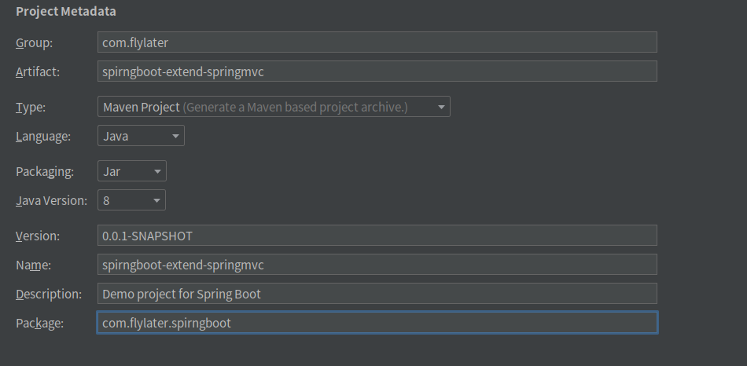
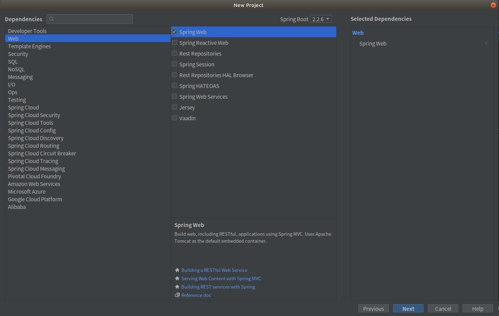
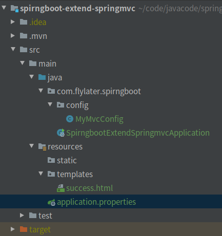
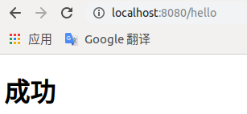

# SpringMVC的定制  

> 本文源码请[点击](https://github.com/flylater/springboot/tree/master/spirngboot-extend-springmvc)

## SpringMVC默认配置  

Spring Boot已经对SpringMVC进行了默认配置，可查看`WebMvcAutoConfiguration`配置类来了解具体默认配置。

## 扩展SpringMVC  

Spring Boot推荐使用配置类来进行配置的扩展。扩展SpringMVC，可编写配置类(类上加注解@Configuration)，并继承`WebMvcConfigurer`，注意不能加注解`@EnableWebMvc`，重写`WebMvcConfigurer`中的方法。  

> Spring Boot2.x已经废弃了WebMvcConfigurerAdapter类，使用WebMvcConfigurer接口来代替

举例验证  

1. 使用Spring Initializr新建一个工程

     

2. 勾选SpringWeb  

     

3. Spring Boot应用创建好了之后在pom.xml里加入thymeleaf的依赖  

   ``` xml
   <dependency>
       <groupId>org.springframework.boot</groupId>
       <artifactId>spring-boot-starter-thymeleaf</artifactId>
   </dependency>
   ```

4. 然后编写模板和配置类

   工程结构图如下：

     

   success.html  

   ``` html
   <!DOCTYPE html>
   <html lang="en" xmlns:th="http://www.thymeleaf.org">
   <head>
       <meta charset="UTF-8">
       <title>Title</title>
   </head>
   <body>
       <h1>成功</h1>
   </body>
   </html>
   ```

   MyMvcConfig类  

   ``` java
   import org.springframework.context.annotation.Configuration;
   import org.springframework.web.servlet.config.annotation.ViewControllerRegistry;
   import org.springframework.web.servlet.config.annotation.WebMvcConfigurer;
   
   @Configuration
   public class MyMvcConfig implements WebMvcConfigurer {
   
       @Override
       public void addViewControllers(ViewControllerRegistry registry) {
           // 游览器发送 /hello，来到success页面
           registry.addViewController("/hello").setViewName("success");
       }
   }
   ```

   无须编写controller，启动Spring Boot应用，在游览器中访问localhost:8080/hello，就会访问success.html页面了  

     

   > MyMvcConfig类也可以写成以下形式
   >
   > ``` java
   > import org.springframework.context.annotation.Bean;
   > import org.springframework.context.annotation.Configuration;
   > import org.springframework.web.servlet.config.annotation.ViewControllerRegistry;
   > import org.springframework.web.servlet.config.annotation.WebMvcConfigurer;
   > 
   > @Configuration
   > public class MyMvcConfig implements WebMvcConfigurer {
   > 
   >     @Bean
   >     public WebMvcConfigurer webMvcConfigurer() {
   >         WebMvcConfigurer webMvcConfigurer = new WebMvcConfigurer() {
   >             @Override
   >             public void addViewControllers(ViewControllerRegistry registry) {
   >                 registry.addViewController("/hello1").setViewName("success");
   >                 registry.addViewController("/hello2").setViewName("success");
   >             }
   >         };
   >         return webMvcConfigurer;
   >     }
   > }
   > ```
   >
   > 在游览器中访问localhost:8080/hello1和localhost:8080/hello2都能跳转到success.html页面  

   

## 取消SpringMVC的默认设置  

在配置类上加上注解`@EnableWebMvc`，Spring Boot的SpringMVC默认配置就失效了，此时配置类的配置就完全取代了SpringMVC的默认配置。

