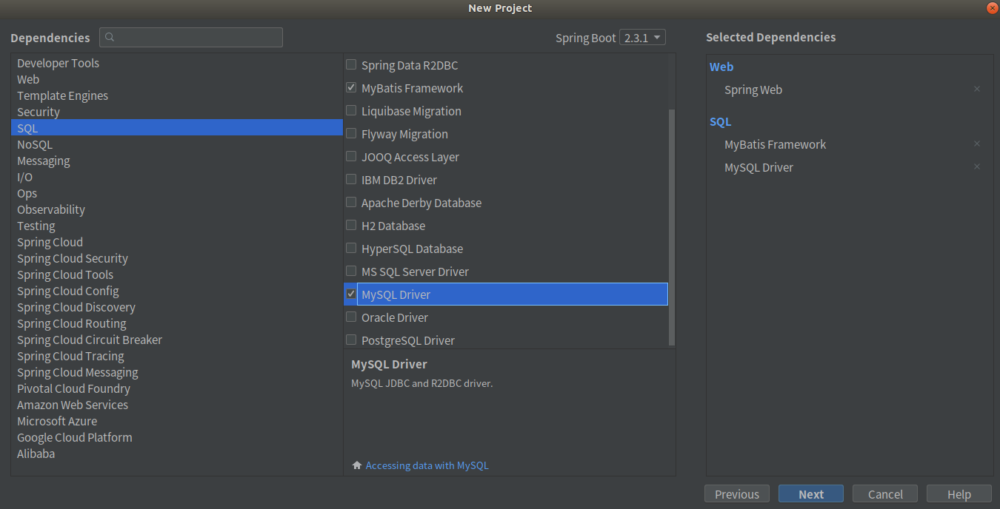

# SpringBoot整合MyBatis  

## 通过SpringInitializr创建SpringBoot应用时引入Mybatis

  

  

  


## 通过添加依赖来引入MyBatis  

>  如果不是通过SpringInitializr创建SpingBoot应用时引入MyBatis的话，后期可以通过在pom文件中添加依赖来引入Mybatis   

``` xml
<!--添加Web依赖 -->
<dependency>
    <groupId>org.springframework.boot</groupId>
    <artifactId>spring-boot-starter-web</artifactId>
</dependency>
<!--添加Mybatis依赖 -->
<dependency>
    <groupId>org.mybatis.spring.boot</groupId>
    <artifactId>mybatis-spring-boot-starter</artifactId>
    <version>2.1.3</version>
</dependency>
<!--添加MySQL驱动依赖 -->
<dependency>
    <groupId>mysql</groupId>
    <artifactId>mysql-connector-java</artifactId>
    <scope>runtime</scope>
</dependency>
```

## 准备数据库  

数据库使用MySQL5.7，创建2张表employee和department，建表语句如下：

``` sql
DROP TABLE IF EXISTS `employee`;
CREATE TABLE `employee` (
  `id` int(11) NOT NULL AUTO_INCREMENT,
  `lastName` varchar(255) DEFAULT NULL,
  `email` varchar(255) DEFAULT NULL,
  `gender` int(2) DEFAULT NULL,
  `d_id` int(11) DEFAULT NULL,
  PRIMARY KEY (`id`)
) ENGINE=InnoDB AUTO_INCREMENT=1 DEFAULT CHARSET=utf8;

DROP TABLE IF EXISTS `department`;
CREATE TABLE `department` (
  `id` int(11) NOT NULL AUTO_INCREMENT,
  `departmentName` varchar(255) DEFAULT NULL,
  PRIMARY KEY (`id`)
) ENGINE=InnoDB AUTO_INCREMENT=1 DEFAULT CHARSET=utf8;
```

