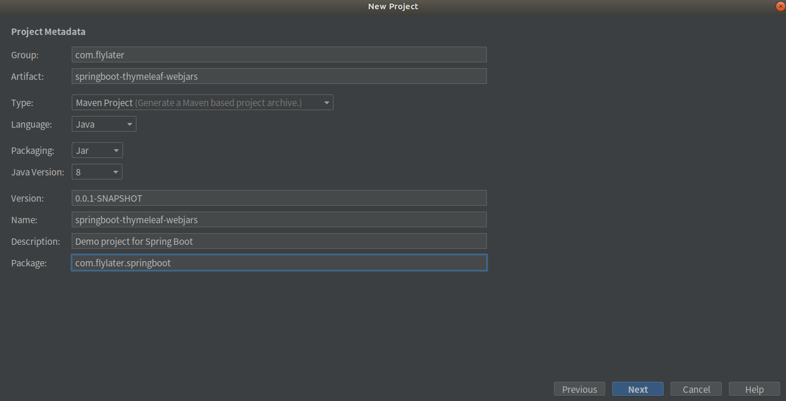
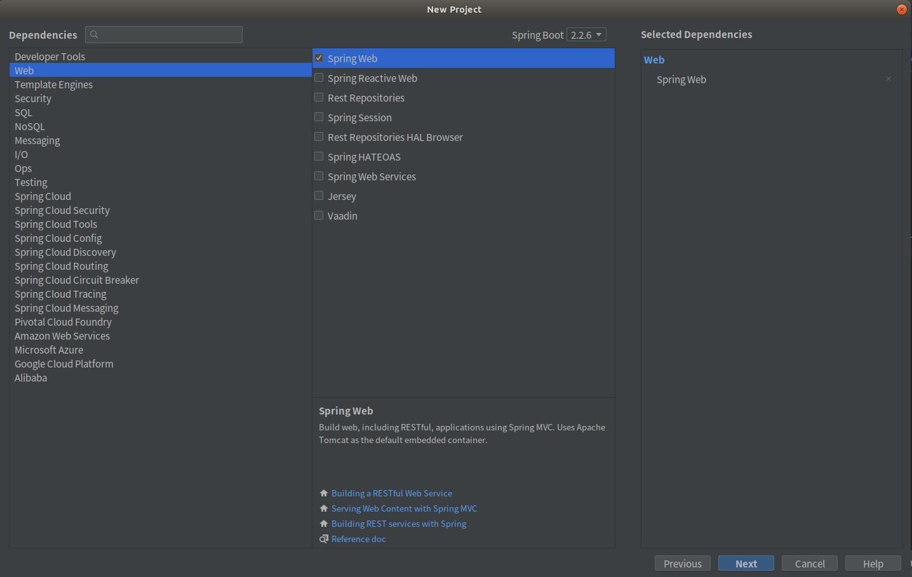
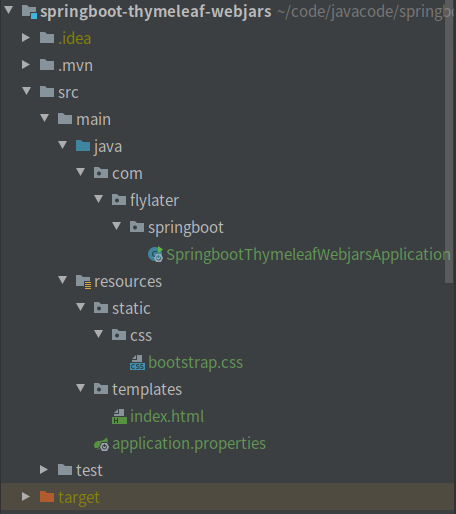
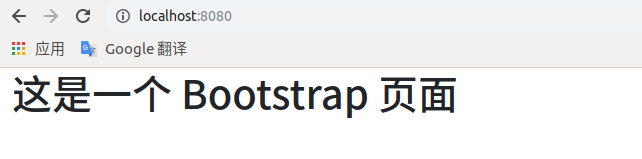

# Thymeleaf与webjars相结合  

> *WebJars*是将通用的Web前端资源打包成Java的Jar包,然后借助Maven等构建工具对其管理  

## 在没使用webjars的情况下使用bootstrap  

1. 使用Spring Initializr新建一个工程

     

     

2. 引入 thymeleaf 模板引擎，在pom.xml中加入依赖

   ``` xml
   <dependency>
       <groupId>org.springframework.boot</groupId>
       <artifactId>spring-boot-starter-thymeleaf</artifactId>
   </dependency>
   ```

3. 把bootstrap.css放在静态资源目录下(resources/static/)，然后编写模板index.html，在html的head中指定bootstrap的引用位置`<link rel="stylesheet" th:href="@{/css/bootstrap.css}">`  

   结构图如下：  

     

   index.html内容如下：  

   ``` html
   <!DOCTYPE html>
   <html lang="en" xmlns:th="http://www.thymeleaf.org">
   <head>
       <meta charset="UTF-8">
       <title>Title</title>
       <link rel="stylesheet" th:href="@{/css/bootstrap.css}">
   </head>
   <body>
   <div class="container-fluid">
       <h1>这是一个 Bootstrap 页面</h1>
   </div>
   </body>
   </html>
   ```

4. 启动Spring Boot应用，输入localhost:8080(默认index.html为首页)  

     


## 通过webjars的情况下使用bootstrap   

1. 使用Spring Initializr新建一个工程

     

     

2. 引入 thymeleaf 模板引擎，在pom.xml中加入依赖

   ``` xml
   <dependency>
       <groupId>org.springframework.boot</groupId>
       <artifactId>spring-boot-starter-thymeleaf</artifactId>
   </dependency>
   ```
   
3.  通过[webjars](https://www.webjars.org/)引入bootstrap，在pomxml中加入依赖  

   ``` xml
   <dependency>
       <groupId>org.webjars.bower</groupId>
       <artifactId>bootstrap</artifactId>
       <version>4.4.1</version>
   </dependency>
   ```

4. 编写模板index.html，在html的head中指定bootstrap的引用位置`<link rel="stylesheet" th:href="@{/webjars/bootstrap/4.4.1/dist/css/bootstrap.css}">`  

   结构图如下：  

     

   index.html内容如下：  

   ``` html
   <!DOCTYPE html>
   <html lang="en" xmlns:th="http://www.thymeleaf.org">
   <head>
       <meta charset="UTF-8">
       <title>Title</title>
       <link rel="stylesheet" th:href="@{/webjars/bootstrap/4.4.1/dist/css/bootstrap.css}">
   </head>
   <body>
   <div class="container-fluid">
       <h1>这是一个 Bootstrap 页面</h1>
   </div>
   </body>
   </html> 
   ```

5. 启动Spring Boot应用，输入localhost:8080(默认index.html为首页)  

     
​     

   