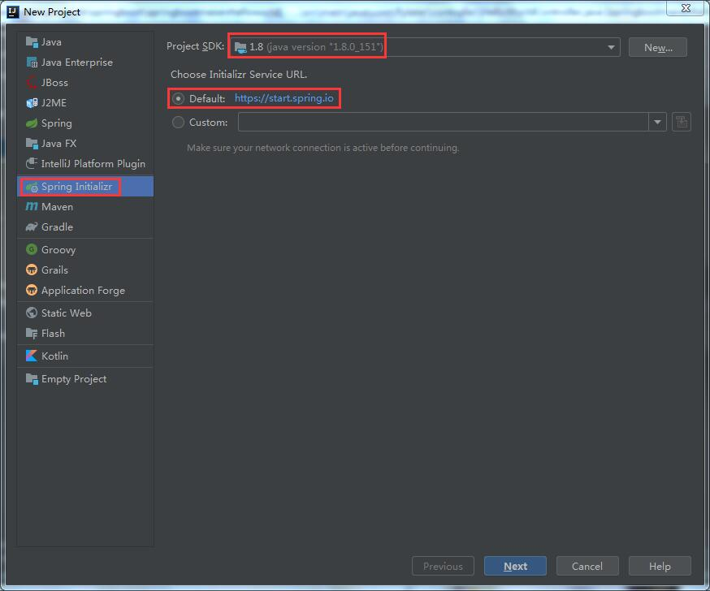
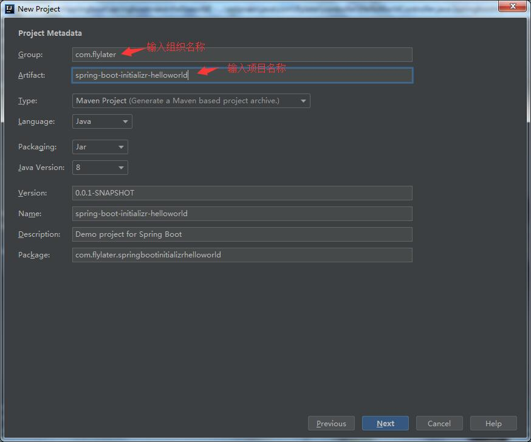
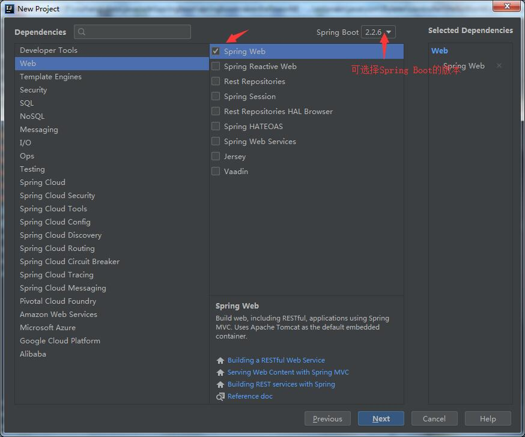
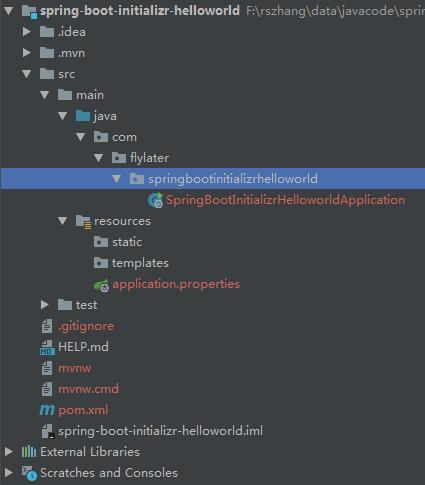
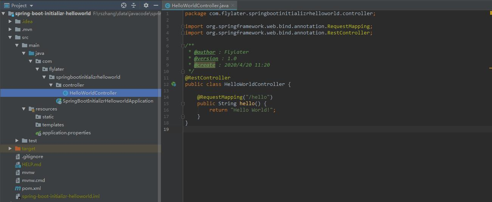

# 使用Spring Initializr快速创建springboot工程  

> 前文介绍了通过Maven创建Spring boot工程，但Spring官方提供了一种更为快速便捷的方式来创建Spring boot工程，就是使用Spring Initializr。  

1. 在IDEA中，点击File->New->Project，选择Spring Initializr，点击Next(注：一定要连接互联网，并能访问Spring官网)  

     

2. 输入Group和Artifact，其余选项保持默认，点击Next  

     

3. 选择Web->Spring Web(这个界面主要选择Spring Boot初始化项目时所加载的组件，这里不选择的话，后期可以通过在pom.xml加入依赖来添加组件，本文只演示最简单的功能，只勾选Spring Web），点击Next直到这个界面关闭  

     

   创建完成之后的Spring Boot应用目录结构图如下：  

       

   Spring Boot的主程序已经自动生成好了。resources文件夹中目录结构具体含义如下：  

   * static：保存所有的静态资源(js、css、images等)  
   * templates：所有的模板页面(Spring )  
   * application.properties：Spring Boot的配置文件  
   
4. 接下来就可以写个HelloWorldController来验证了  

     

   通过主程序SpringBootInitializrHelloworldApplication启动应用，游览器输入localhost:8080/hello，页面显示Hello World！

