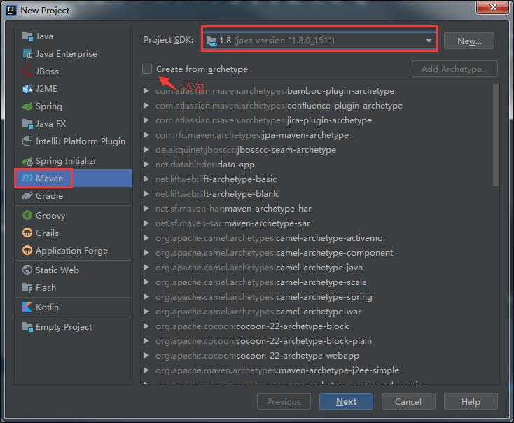
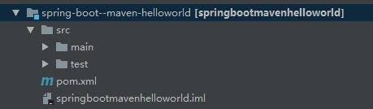

# 使用Maven创建Spring Boot工程  

> 本文通过Maven来创建Spring boot工程，主要目的是介绍Spring Boot工程创建时的一些细节  

## 创建一个Maven工程  

### IDEA创建Maven工程  

1. 选择IDEA的File->New->Project，在打开的界面选择Maven，选择Project SDK，点击Next。  




2. 输入 GroupId(组织名称) 和 ArtifactId(项目/模块名称) ，然后继续点击Next直至完成。项目组织图应该如下：  

     

   

3. 导入Spring Boot相关的依赖，在pom.xml里添加以下内容  

   ```xml
   <parent>
       <groupId>org.springframework.boot</groupId>
       <artifactId>spring-boot-starter-parent</artifactId>
       <version>2.2.6.RELEASE</version>
   </parent>
   <dependencies>
       <dependency>
           <groupId>org.springframework.boot</groupId>
           <artifactId>spring-boot-starter-web</artifactId>
       </dependency>
   </dependencies>
   ```

   内容解析：spring-boot-starter-parent是Spring Boot的版本控制中心，有了这个以后再导入依赖默认是不需要写版本的，但是没有在版本控制中心里的依赖仍旧需要声明版本号。spring-boot-starter-web是Spring Boot场景启动器(spring-boot-starter)自动导入web模块正常运行所依赖的组件。

   