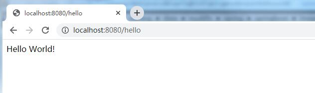

# 使用Maven创建Spring Boot工程  

> 本文通过Maven来创建Spring boot工程，主要目的是介绍Spring Boot工程创建时的一些细节  

## 创建一个Maven工程  

### IDEA创建Maven工程  

1. 选择IDEA的File->New->Project，在打开的界面选择Maven，选择Project SDK，点击Next。  

  

2. 输入 GroupId(组织名称) 和 ArtifactId(项目/模块名称) ，然后继续点击Next直至完成。项目组织图应该如下：  

     

3. 导入Spring Boot相关的依赖，在pom.xml里添加以下内容  

   ```xml
   <parent>
       <groupId>org.springframework.boot</groupId>
       <artifactId>spring-boot-starter-parent</artifactId>
       <version>2.2.6.RELEASE</version>
   </parent>
   <dependencies>
       <dependency>
           <groupId>org.springframework.boot</groupId>
           <artifactId>spring-boot-starter-web</artifactId>
       </dependency>
   </dependencies>
   ```

   内容解析：spring-boot-starter-parent是Spring Boot的版本控制中心，有了这个以后再导入依赖默认是不需要写版本的，但是没有在版本控制中心里的依赖仍旧需要声明版本号。spring-boot-starter-web是Spring Boot场景启动器(spring-boot-starter)自动导入web模块正常运行所依赖的组件。

4. 编写HelloWorldController  

   ``` java
   import org.springframework.stereotype.Controller;
   import org.springframework.web.bind.annotation.RequestMapping;
   import org.springframework.web.bind.annotation.ResponseBody;
   
   @Controller
   public class HelloWorldController {
   
       @ResponseBody
       @RequestMapping("/hello")
       public String hello() {
           return "Hello World!";
       }
   }
   ```  

   效果如下：  

     

   HelloWorldController也可以编写成如下形式：  

   ```java
   import org.springframework.web.bind.annotation.RequestMapping;
   import org.springframework.web.bind.annotation.RestController;
   
   @RestController
   public class HelloWorldController {
   
       @RequestMapping("/hello")
       public String hello() {
           return "Hello World!";
       }
   }
   ```  

   解释下@Controller与@RestController的区别：  

   * @RestControlle相当于@Controller+@ResponseBody。  
   * 如果需要将数据(文本、JSON、XML等)响应到当前页面，使用@RestController或@Controller+@ResponseBody。  
   * 如果需要返回html、jsp等页面，使用@Controller，此时内容将通过视图解析器 (InternalResourceViewResolver)映射到对应的html、jsp页面中去。 

5. 编写主程序启动Spring Boot应用  

   ```java
   import org.springframework.boot.SpringApplication;
   import org.springframework.boot.autoconfigure.SpringBootApplication;
   
   @SpringBootApplication
   public class HelloWorldMainApplication {
       public static void main(String[] args) {
           // 启动Spring应用
           SpringApplication.run(HelloWorldMainApplication.class, args);
       }
   }
   ```  

   项目结构图目前如下：  

     

6. 启动Spring Boot，查看运行效果  

   1. 在HelloWorldMainApplication类上右键，然后选择run  

        

   2. 出现如下图提示时，则说明Spring boot启动成功。  

        

   3. 验证结果，打开游览器，输入localhost:8080/hello，出现如下图则说明成功  

        


   