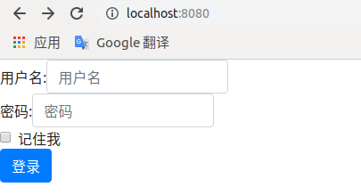

# 国际化

1. 使用Spring Initializr创建一个Spring Boot应用。  

     

     

     

2. 通过[webjars](https://www.webjars.org/)引入bootstrap，在pomxml中加入依赖  

   ``` xml
   <dependency>
       <groupId>org.webjars.bower</groupId>
       <artifactId>bootstrap</artifactId>
       <version>4.4.1</version>
   </dependency>
   ```
   
3. 编写国际化配置文件，比如编写默认、中文、英文三个配置文件，项目结构如下：  

       

   login.properties  

   ``` pro
   login.btn=登陆!
   login.password=密码!
   login.remember=记住我!
   login.username=用户名!
   ```

   login_en_US.properties  

   ``` proper
   login.username=UserName
   login.password=Password
   login.remember=Remember Me
   login.btn=Sign In
   ```

   login_zh_CN.properties  

   ``` pro
   login.btn=登录
   login.password=密码
   login.remember=记住我
   login.username=用户名
   ```

4. 配置国际化配置文件的位置  

   在Spring Boot的配置文件(application.properties)中指定国际化文件的位置`spring.messages.basename=i18n.login`  

     

5. 编写Controller  

     

   LoginController类  

   ``` java
   import org.springframework.stereotype.Controller;
   import org.springframework.web.bind.annotation.RequestMapping;
   
   @Controller
   public class LoginController {
   
       @RequestMapping({"/", "/login"})
       public String index() {
           return "login";
       }
   
   }
   ```

6. 编写页面模板login.html  

     

   login.html  

   ``` html
   <!DOCTYPE html>
   <html lang="en" xmlns:th="http://www.thymeleaf.org">
   <head>
       <meta charset="UTF-8">
       <title>Title</title>
       <link rel="stylesheet" th:href="@{/webjars/bootstrap/4.4.1/dist/css/bootstrap.css}">
   </head>
   <body>
   <div>
       <form class="form-signin" th:action="@{/login}" method="post">
           <div class="form-inline">
               <label th:text="#{login.username} + ':'">Username</label>
               <input type="text" class="form-control" name="username" th:placeholder="#{login.username}"/>
           </div>
           <div class="form-inline">
               <label th:text="#{login.password} + ':'">Password</label>
               <input type="text" class="form-control" name="password" th:placeholder="#{login.password}"/>
           </div>
           <div class="form-check">
               <label class="form-check-label">
                   <input class="form-check-input" type="checkbox"/> [[#{login.remember}]]
               </label>
           </div>
           <button type="submit" class="btn btn-primary" th:text="#{login.btn}">Submit</button>
       </form>
   </div>
   </body>
   </html>
   ```

7. 启动Spring Boot应用，输入localhost:8080，结果如下图  

     

   > 此时页面显示的语言是跟随游览器的语言区域设置的，以后的步骤是在页面上添加切换语言的链接，通过点击链接来切换语言设置，原理是在点击链接发送的请求中加上区域信息  

8. 在页面模板login.html中加入切换语言的链接  

     

   login.html  

   ``` html  
   <a class="btn btn-sm" th:href="@{/login(l='zh_CN')}">中文</a>
   <a class="btn btn-sm" th:href="@{/login(l='en_US')}">English</a>
   ```

9. 重写国际化解析器 `LocaleResolver`并将重写后的`LocaleResolver`加入到SpirngMVC的配置中  
   

  

MyMvcConfig类  

   ``` java
   import org.springframework.context.annotation.Bean;
   import org.springframework.context.annotation.Configuration;
   import org.springframework.util.StringUtils;
   import org.springframework.web.servlet.LocaleResolver;
   import org.springframework.web.servlet.config.annotation.WebMvcConfigurer;
   
   import javax.servlet.http.HttpServletRequest;
   import javax.servlet.http.HttpServletResponse;
   import java.util.Locale;
   
   @Configuration
   public class MyMvcConfig implements WebMvcConfigurer {
   
       @Bean
       public LocaleResolver localeResolver() {
   
           LocaleResolver localeResolver = new LocaleResolver() {
               @Override
               public Locale resolveLocale(HttpServletRequest httpServletRequest) {
                   String l = httpServletRequest.getParameter("l");
                   Locale locale = Locale.getDefault();
                   if (!StringUtils.isEmpty(l)) {
                       String[] split = l.split("_");
                       locale = new Locale(split[0], split[1]);
                   }
                   return locale;
               }
   
               @Override
               public void setLocale(HttpServletRequest httpServletRequest, HttpServletResponse httpServletResponse, Locale locale) {
   
               }
           };
           return localeResolver;
       }
   }
   ```

 10. 启动Spring Boot应用，访问localhost:8080，然后点击中文、英文 切换显示语言  

       

       

 > 为了方便后期维护，通常会把LocaleResolver当成1个组件抽取出来，然后在SpringMVC的配置中用@Bean注册到SpringMVC容器里，详情见下图  
 >
 >   
 >
 >   
 >
 MyLocaleResolver类  

``` java
package com.flylater.springboot.component;

import org.springframework.util.StringUtils;
import org.springframework.web.servlet.LocaleResolver;

import javax.servlet.http.HttpServletRequest;
import javax.servlet.http.HttpServletResponse;
import java.util.Locale;

public class MyLocaleResolver implements LocaleResolver {

    @Override
    public Locale resolveLocale(HttpServletRequest httpServletRequest) {
        String l = httpServletRequest.getParameter("l");
        Locale locale = Locale.getDefault();
        if (!StringUtils.isEmpty(l)) {
            String[] split = l.split("_");
            locale = new Locale(split[0], split[1]);
        }
        return locale;
    }

    @Override
    public void setLocale(HttpServletRequest httpServletRequest, HttpServletResponse httpServletResponse, Locale locale) {

    }
}
```

MyMvcConfig类

``` java
package com.flylater.springboot.config;

import com.flylater.springboot.component.MyLocaleResolver;
import org.springframework.context.annotation.Bean;
import org.springframework.context.annotation.Configuration;
import org.springframework.web.servlet.LocaleResolver;
import org.springframework.web.servlet.config.annotation.WebMvcConfigurer;

@Configuration
public class MyMvcConfig implements WebMvcConfigurer {

    @Bean
    public LocaleResolver localeResolver() {
        return new MyLocaleResolver();
    }
}

```


​       

​     

   

   

   


