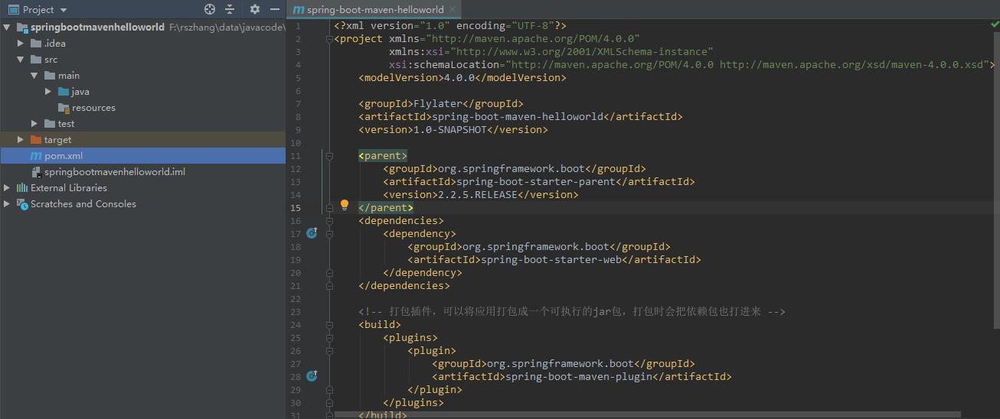
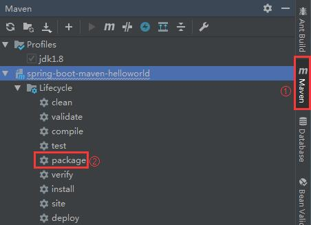
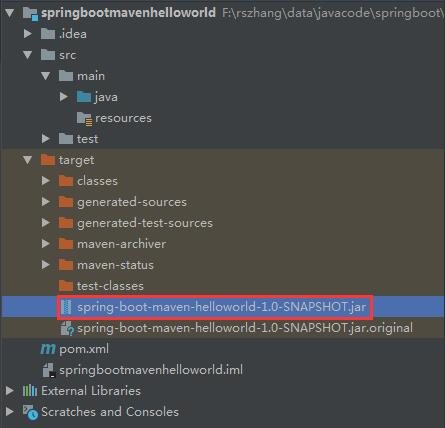

# Spring boot打成可执行jar包  

1. 在pom.xml中加入以下内容  

   ```xml
   <!-- 打包插件，可以将应用打包成一个可执行的jar包，打包时会把依赖包也打进来 -->
   <build>
       <plugins>
           <plugin>
               <groupId>org.springframework.boot</groupId>
               <artifactId>spring-boot-maven-plugin</artifactId>
           </plugin>
       </plugins>
   </build>
   ```

   目前pom.xml的内容应如下：  

     

2. 在IDEA的侧边栏把Maven打开，选择当前项目的Lifecycle，然后双击package  

     

3. 等待Maven运行完成之后，就可以找到jar包了，jar在下图的位置：  

     

4. 打开jar包所在的目录(在IDEA目录jar包上右键，选择Show in Explorer)，然后在当前目录打开CMD， 输入`java -jar [jar包名称]`，然后回车  

     

5.  启动完成之后，就可以在游览器输入localhost:8080/hello验证是否启动成功了