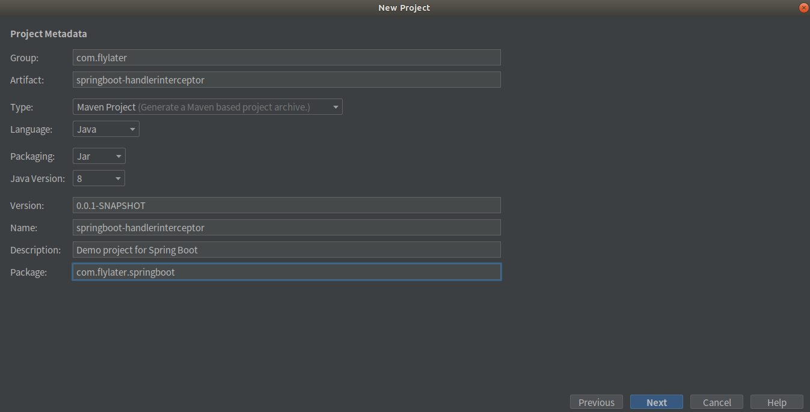
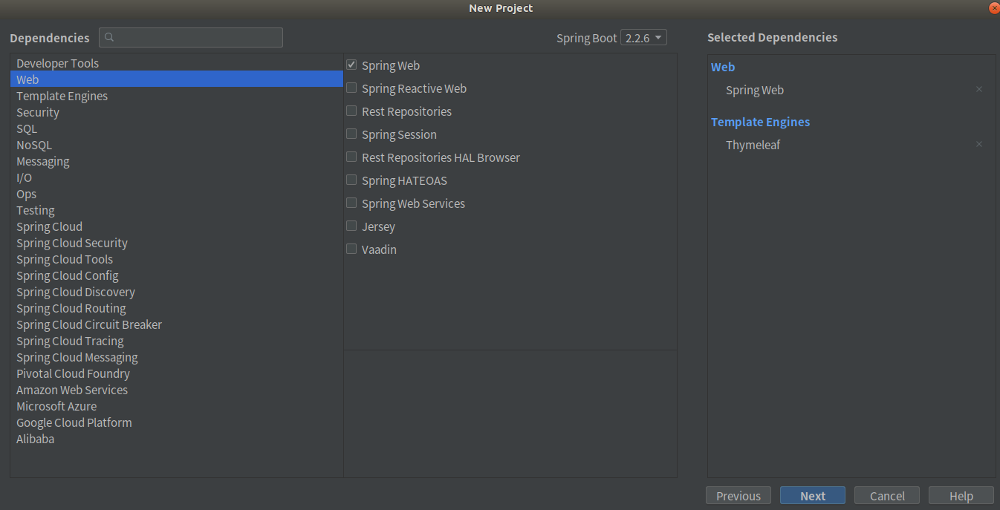
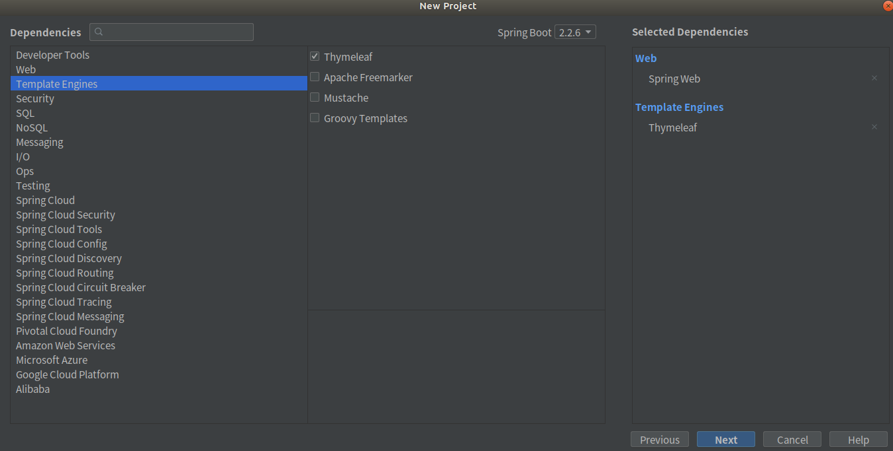
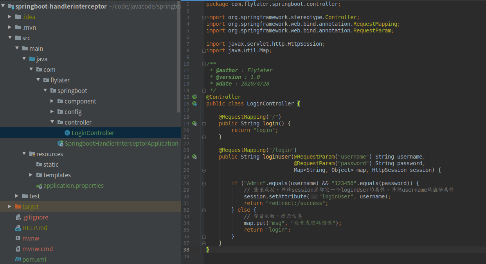
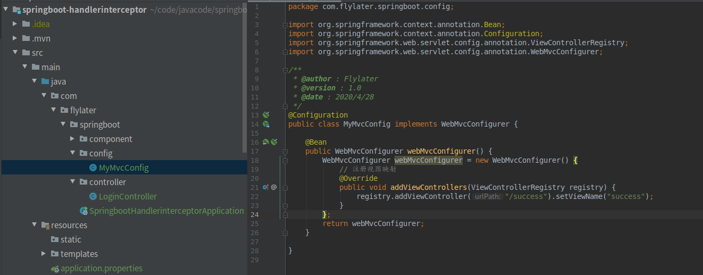
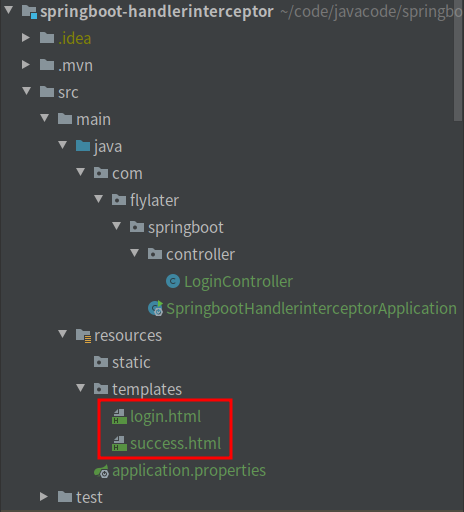
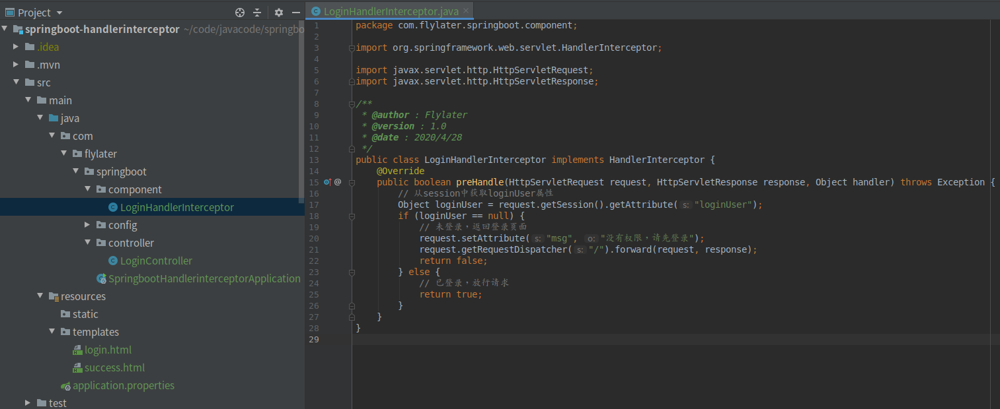
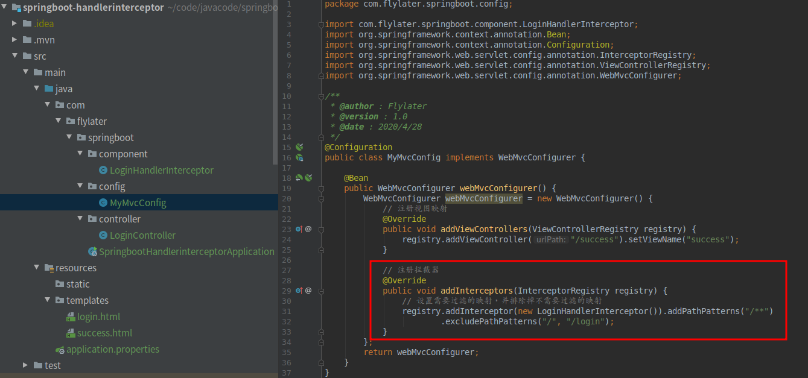
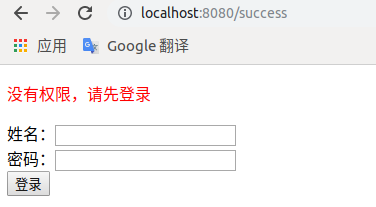

# 拦截器  

> 登录之后才能访问某个页面，没有登录不能直接访问某个页面  

1. 使用Spring Initializr创建一个Spring Boot应用  

     

     

     

2. 编写HelloController，如果账号密码正确显示成功页面，否则还是显示登录页面  

     

   LoginController类  

   ``` java
   import org.springframework.stereotype.Controller;
   import org.springframework.web.bind.annotation.RequestMapping;
   import org.springframework.web.bind.annotation.RequestParam;
   
   import javax.servlet.http.HttpSession;
   import java.util.Map;
   
   @Controller
   public class LoginController {
   
       @RequestMapping("/")
       public String login() {
           return "login";
       }
   
       @RequestMapping("/login")
       public String loginUser(@RequestParam("username") String username,
                               @RequestParam("password") String password,
                               Map<String, Object> map, HttpSession session) {
   
           if ("Admin".equals(username) && "123456".equals(password)) {
               // 登录成功，并往session里绑定一个loginUser的属性，并把username赋值给属性
               session.setAttribute("loginUser", username);
               return "redirect:/success";
           } else {
               // 登录失败，提示信息
               map.put("msg", "账号或密码错误");
               return "login";
           }
       }
   }
   ```

3. 编写视图映射关系，并注册在SpringMVC容器里  

     

   MyMvcConfig类  

   ``` java
   import com.flylater.springboot.component.LoginHandlerInterceptor;
   import org.springframework.context.annotation.Bean;
   import org.springframework.context.annotation.Configuration;
   import org.springframework.web.servlet.config.annotation.InterceptorRegistry;
   import org.springframework.web.servlet.config.annotation.ViewControllerRegistry;
   import org.springframework.web.servlet.config.annotation.WebMvcConfigurer;
   
   @Configuration
   public class MyMvcConfig implements WebMvcConfigurer {
   
       @Bean
       public WebMvcConfigurer webMvcConfigurer() {
           WebMvcConfigurer webMvcConfigurer = new WebMvcConfigurer() {
               // 注册视图映射
               @Override
               public void addViewControllers(ViewControllerRegistry registry) {
                   registry.addViewController("/success").setViewName("success");
               }
           };
        return webMvcConfigurer;
       }
}
   ```
   
4. 编写login.html和success.html  

       

   login.html  

   ``` html
   <!DOCTYPE html>
   <html lang="en" xmlns:th="http://www.thymeleaf.org">
   <head>
       <meta charset="UTF-8">
       <title>Title</title>
   </head>
   <body>
     <div>
       <form th:action="@{/login}" method="post">
           <p style="color: red" th:text="${msg}" th:if="${not #strings.isEmpty(msg)}"></p>
           姓名：<input type="text" name="username"/>
           <br/>
           密码：<input type="text" name="password"/>
           <br/>
           <input type="submit" value="登录"/>
       </form>
     </div>
   </body>
   </html>
   ```

   success.html  

   ``` html
   <!DOCTYPE html>
   <html lang="en">
   <head>
       <meta charset="UTF-8">
       <title>Title</title>
   </head>
   <body>
       <h1> 登录成功！ </h1>
   </body>
   </html>
   ```

5. 此时启动Spring Boot应用，登录成功会去往success页面，登录不成功会返回login页面，但是不登录在游览器里直接输入http://localhost:8080/success，也是可以打开success页面的，要想必须登录之后才能打开success页面，需要加入拦截器过滤请求。  

6. 编写拦截器LoginHandlerInterceptor  

     

   LoginHandlerInterceptor类  

   ``` java
   import org.springframework.web.servlet.HandlerInterceptor;
   
   import javax.servlet.http.HttpServletRequest;
   import javax.servlet.http.HttpServletResponse;
   
   public class LoginHandlerInterceptor implements HandlerInterceptor {
       @Override
       public boolean preHandle(HttpServletRequest request, HttpServletResponse response, Object handler) throws Exception {
           // 从session中获取loginUser属性
           Object loginUser = request.getSession().getAttribute("loginUser");
           if (loginUser == null) {
               // 未登录，返回登录页面
               request.setAttribute("msg", "没有权限，请先登录");
               request.getRequestDispatcher("/").forward(request, response);
               return false;
           } else {
               // 已登录，放行请求
               return true;
           }
       }
   }
   ```

7. 将拦截器注册到SpringMVC容器中  

     

   MyMvcConfig类  

   ``` java
    import com.flylater.springboot.component.LoginHandlerInterceptor;
    import org.springframework.context.annotation.Bean;
    import org.springframework.context.annotation.Configuration;
    import org.springframework.web.servlet.config.annotation.InterceptorRegistry;
    import org.springframework.web.servlet.config.annotation.ViewControllerRegistry;
    import org.springframework.web.servlet.config.annotation.WebMvcConfigurer;

    @Configuration
    public class MyMvcConfig implements WebMvcConfigurer {

        @Bean
        public WebMvcConfigurer webMvcConfigurer() {
            WebMvcConfigurer webMvcConfigurer = new WebMvcConfigurer() {
                // 注册视图映射
                @Override
                public void addViewControllers(ViewControllerRegistry registry) {
                    registry.addViewController("/success").setViewName("success");
                }

                // 注册拦截器
                @Override
                public void addInterceptors(InterceptorRegistry registry) {
                    // 设置需要过滤的映射，并排除掉不需要过滤的映射
                    registry.addInterceptor(new LoginHandlerInterceptor()).addPathPatterns("/**")
                            .excludePathPatterns("/", "/login");
                }
            };
            return webMvcConfigurer;
        }
    }
   ```

8. 然后启动Spring Boot应用，登录成功会去往success页面，登录不成功会返回login页面，但是不登录在游览器里直接输入http://localhost:8080/success，会跳转到login页面，并提示没有权限  

     

