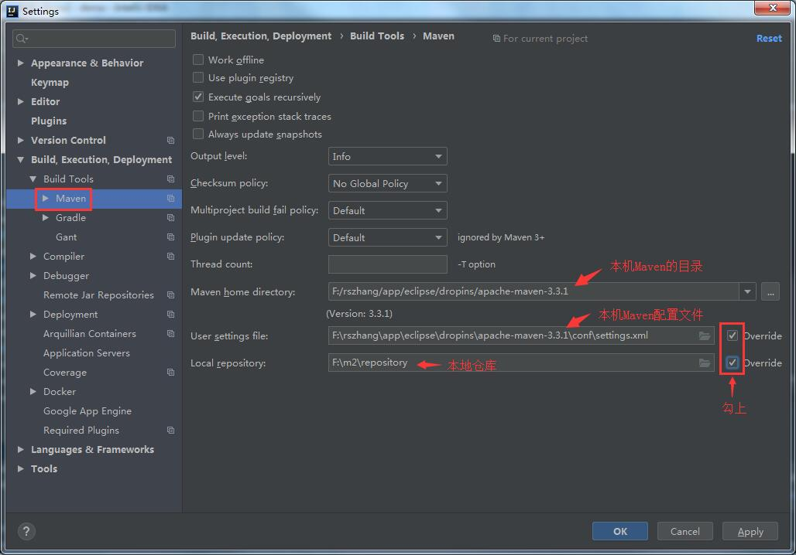

# 环境准备  

## 环境要求  

* JDK：Spring Boot官方推荐jdk1.8以上
* Maven：Spring Boot官方推荐Maven 3.2+
* IDE：Spring Boot官方推荐 Spring Tool Suite (STS)或者 IntelliJ IDEA

> 本文使用的是jdk1.8.0_151，maven  3.3.1，IDEA 2019.1.3  

## Maven设置  

给maven的settings.xml配置文件的profiles标签添加以下内容：  

```xml
<profile>
    <id>jdk1.8</id>
    <activation>
        <activeByDefault>true</activeByDefault>
        <jdk>1.8</jdk>
    </activation>
    <properties>
        <project.build.sourceEncoding>UTF-8</project.build.sourceEncoding>
        <maven.compiler.source>1.8</maven.compiler.source>
        <maven.compiler.target>1.8</maven.compiler.target>
        <maven.compiler.compilerVersion>1.8</maven.compiler.compilerVersion>
    </properties>
</profile>
```


## IDEA整合Maven  

  

> 

